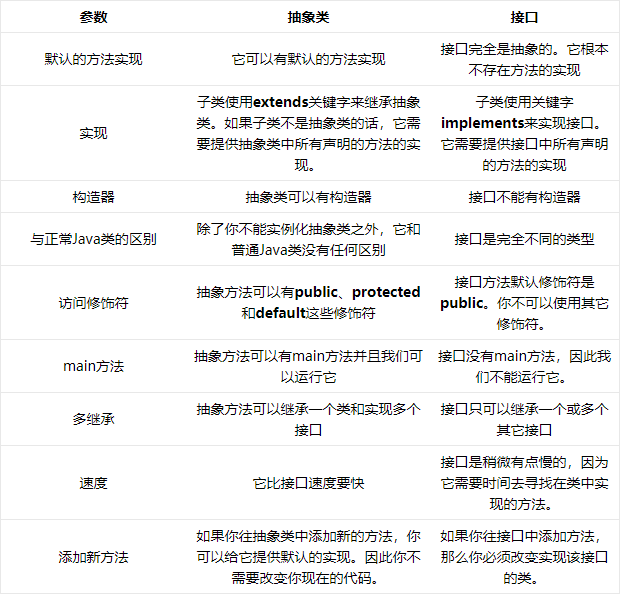

[未完待续](https://blog.csdn.net/z1002137615/article/details/50943869)

## Static 

### static的用途

&emsp;&emsp;<java编程思想>中有这样一句话

> static方法就是没有this的方法。在static方法内部不能调用非静态方法，反过来是可以的。而且可以在没有创建
> 任何对象的前提下，仅仅通过类本身来调用static方法。这实际上正是static方法的主要用途。

&emsp;&emsp;这段话虽然只是说明了static方法的特殊之处，但是可以看出static关键字的基本作用，简而言之，一句话来描述就是：

&emsp;&emsp;`方便在没有创建对象的情况下来进行调用（方法/变量）`

&emsp;&emsp;很显然，被static关键字修饰的方法或者变量不需要依赖于对象来进行访问，只要类被加载了，就可以通过类名去进行访问。

&emsp;&emsp;static可以用来修饰类的成员方法、类的成员变量，另外可以编写static代码块来优化程序性能。

#### static修饰方法

&emsp;&emsp;static方法一般称作静态方法，由于静态方法不依赖于任何对象就可以进行访问，因此对于静态方法来说，是没有this的，因为它不依附于任何对象，既然都没有对象，就谈不上this了。并且由于这个特性，在静态方法中不能访问类的非静态成员变量和非静态成员方法，因为非静态成员方法/变量都是必须依赖具体的对象才能够被调用。

&emsp;&emsp;但是要注意的是，虽然在静态方法中不能访问非静态成员方法和非静态成员变量，但是在非静态成员方法中是可以访问静态成员方法/变量的。

&emsp;&emsp;而对于非静态成员方法，它访问静态成员方法/变量显然是毫无限制的。

&emsp;&emsp;因此，如果说想在不创建对象的情况下调用某个方法，就可以将这个方法设置为static。我们最常见的static方法就是main方法，至于为什么main方法必须是static的，现在就很清楚了。因为程序在执行main方法的时候没有创建任何对象，因此只有通过类名来访问。

&emsp;&emsp;有这么一个说法构造器是可以是静态的，这个说法是错误的，因为`构造器里面隐藏有this关键字`，但是static方法里面不能有this关键字，this是指调用当前方法的对象，而静态方法不属于任何对象。构造器只负责初始化，不负责创建实例

#### staitc修饰成员变量

&emsp;&emsp;static变量也称作静态变量，静态变量和非静态变量的区别是：静态变量被所有的对象所共享，在内存中只有一个副本，它当且仅当在类初次加载时会被初始化。而非静态变量是对象所拥有的，在创建对象的时候被初始化，存在多个副本，各个对象拥有的副本互不影响。

&emsp;&emsp;static成员变量的初始化顺序按照定义的顺序进行初始化。

#### 修饰代码块

&emsp;&emsp;static关键字还有一个比较关键的作用就是 用来形成静态代码块以优化程序性能。static块可以置于类中的任何地方，类中可以有多个static块。在类初次被加载的时候，会按照static块的顺序来执行每个static块，并且只会执行一次。

&emsp;&emsp;为什么说static块可以用来优化程序性能，是因为它的特性:只会在类加载的时候执行一次。下面看个例子:

```
class Person{
    private Date birthDate;
     
    public Person(Date birthDate) {
        this.birthDate = birthDate;
    }
     
    boolean isBornBoomer() {
        Date startDate = Date.valueOf("1946");
        Date endDate = Date.valueOf("1964");
        return birthDate.compareTo(startDate)>=0 && birthDate.compareTo(endDate) < 0;
    }
}
````

&emsp;&emsp;isBornBoomer是用来这个人是否是1946-1964年出生的，而每次isBornBoomer被调用的时候，都会生成startDate和birthDate两个对象，造成了空间浪费，如果改成这样效率会更好：

````
class Person{
    private Date birthDate;
    private static Date startDate,endDate;
    static{
        startDate = Date.valueOf("1946");
        endDate = Date.valueOf("1964");
    }
     
    public Person(Date birthDate) {
        this.birthDate = birthDate;
    }
     
    boolean isBornBoomer() {
        return birthDate.compareTo(startDate)>=0 && birthDate.compareTo(endDate) < 0;
    }
}
````

## static存在的误区

### static关键字会改变类中成员的访问权限吗？
&emsp;&emsp;在Java中能够影响到访问权限的只有private、public、protected（包括包访问权限）这几个关键字。

### 能通过this访问静态成员变量吗？

````
public class Main {　　
    static int value = 33;
 
    public static void main(String[] args) throws Exception{
        new Main().printValue();
    }
 
    private void printValue(){
        int value = 3;
        System.out.println(this.value);
    }
}
````

&emsp;&emsp;这里面主要考察队this和static的理解。this代表什么？this代表当前对象，那么通过new Main()来调用printValue的话，当前对象就是通过new Main()生成的对象。而static变量是被对象所享有的，因此在printValue中的this.value的值毫无疑问是33。在printValue方法内部的value是局部变量，根本不可能与this关联，所以输出结果是33。在这里永远要记住一点：静态成员变量虽然独立于对象，但是不代表不可以通过对象去访问，所有的静态方法和静态变量都可以通过对象访问（只要访问权限足够）。

### static能作用于局部变量么？

&emsp;&emsp;但是在Java中切记：static是不允许用来修饰局部变量。不要问为什么，这是Java语法的规定。

&emsp;&emsp;static 变量是给类用的。这样类初始化的时候，就会给static进行初始化.如果你在方法里面定义一个static。这时候编译器就不知道你这个变量怎么初始化了这个是和java的设计相关的。java全是面向对象设计的，单独一个方法不能持有一块空间。

## 总结

&emsp;&emsp;static可以修饰方法，修饰成员变量，修饰代码块，static内部不能调用非静态方法，可以在不创建对象的情况下，通过类本身来调用static方法和变量。被static修饰的方法、成员变量、代码块在类加载的时候加载，他是被所有的实例对象共享
````
栈内存：局部变量和对象的引用变量；
堆内存：对象；
````

&emsp;&emsp;Static是在堆内存的数据区

&emsp;&emsp;修饰方法时，应为static修饰的方法是属于类的，不需要通过对象进行调用，所以static方法里面没有`this关键字，所以同时也不能调用非静态变量和方法。Main方法`

&emsp;&emsp;修饰变量
&emsp;&emsp;静态变量是被所有的对象所共享的，在内存只有一份，是在类的加载而加载的。而非静态变量是属于实例对象的，在内存中有多个备份，创建的对象的时候初始化，存在多个副本，而且各个副本互不影响

&emsp;&emsp;修饰代码块
&emsp;&emsp;用来形成静态代码块以优化程序性能。static块可以置于类中的任何地方，类中可以有多个static块。在类初次被加载的时候，会按照static块的顺序来执行每个static块，并且只会执行一次。

&emsp;&emsp;在单例模式中会用到static，详细请见同目录下的单例模式详解[单例模式](https://github.com/only-wjt/java/blob/master/basic/Singleton.md)


## abstract

&emsp;&emsp;使用了abstract关键字的类就是抽象类，使用了abstract关键字的方法就是抽象方法。按照常理来说，抽象类会包含一个以上的抽象方法。言下之意，你非要让一个抽象类不包含抽象方法，也是可以的。但是只要包含了一个抽象方法，这个类就必须是抽象类。抽象类（抽象方法）通常都是继承时会用的到，是java多态性的体现。

&emsp;&emsp;创建抽象类和方法有时对我们非常有用，因为它们使一个类的抽象变成明显的事实，可明确告诉用户和编译器自己打算如何用它。

&emsp;&emsp;abstract用法其实比较简单：

````
abstract class Instrument4 {
	int i; // storage allocated for each
	public abstract void play();
	public String what() {
	    return "Instrument4";
    }
    public abstract void adjust();
}
 
class Wind4 extends Instrument4 {
	public void play() {
	    System.out.println("Wind4.play()");
	}
	public String what() {
		return "Wind4"; 
	}
	public void adjust() {}
}
 
class Percussion4 extends Instrument4 {
	public void play() {
	    System.out.println("Percussion4.play()");
	}
	public String what() {
		return "Percussion4";
	}
	public void adjust() {}
}
 
class Stringed4 extends Instrument4 {
	public void play() {
	    System.out.println("Stringed4.play()");
	}
	public String what() {
		return "Stringed4";
	}
	public void adjust() {}
}
 
class Brass4 extends Wind4 {
	public void play() {
	    System.out.println("Brass4.play()");
	}
	public void adjust() {
	    System.out.println("Brass4.adjust()");
	}
}
 
class Woodwind4 extends Wind4 {
	public void play() {
	    System.out.println("Woodwind4.play()");
	}
	public String what() {
		return "Woodwind4"; 
	}
}
 
class Music4 {
	// Doesn't care about type, so new types
	// added to the system still work right:
	static void tune(Instrument4 i) {
		// ...
		i.play();
	}
	static void tuneAll(Instrument4[] e) {
		for(int i = 0; i < e.length; i++)
		    tune(e[i]);
	}
	public static void main(String[] args) {
		Instrument4[] orchestra = new Instrument4[5];
		int i = 0;
		// Upcasting during addition to the array:
		orchestra[i++] = new Wind4();
		orchestra[i++] = new Percussion4();
		orchestra[i++] = new Stringed4();
		orchestra[i++] = new Brass4();
		orchestra[i++] = new Woodwind4();
		tuneAll(orchestra);
	}
} 

````

&emsp;&emsp;注意点：

&emsp;&emsp;1.一个抽象类不一定有抽象方法，但只要有一个抽象方法就一定是抽象类。

&emsp;&emsp;2.抽象类不可创建新对象。但是抽象类允许有构造方法。（子类可以继承构造方法）

&emsp;&emsp;3.子类继承抽象类必须实现其中抽象方法，除非子类也是抽象类。

&emsp;&emsp;4.抽象类的非抽象方法都可以被正常调用。调用方式包括通过子类调用，直接调用static方法等。

&emsp;&emsp;5.abstract 不能与private、static、final、native、synchronized共用。（相互之间矛盾，直接编译报错）

## interface
&emsp;&emsp;接口是抽象方法的集合。如果一个类实现了某个接口，那么它就继承了这个接口的抽象方法。这就像契约模式，如果实现了这个接口，那么就必须确保使用这些方法。接口只是一种形式，接口自身不能做任何事情。

### 接口和抽象类的区别



### 什么时候使用抽象类和接口

&emsp;&emsp;如果你拥有一些方法并且想让它们中的一些有默认实现，那么使用抽象类吧。

&emsp;&emsp;如果你想实现多重继承，那么你必须使用接口。由于Java不支持多继承，子类不能够继承多个类，但可以实现多个接口。因此你就可以使用接口来解决它。

&emsp;&emsp;如果基本功能在不断改变，那么就需要使用抽象类。如果不断改变基本功能并且使用接口，那么就需要改变所有实现了该接口的类。


## final[转载](http://www.cnblogs.com/dolphin0520/p/3736238.html)

&emsp;&emsp;前言：final关键字一般会在匿名内部类用到，而且，我们常用的String也是用fianl修饰的

### final关键字的基本用法

&emsp;&emsp;在Java中，final关键字可以用来修饰类、方法和变量（包括成员变量和局部变量）。

#### final用来修饰类

&emsp;&emsp;当用final修饰一个类时，表明这个类不能被继承。也就是说，如果一个类你永远不会让他被继承，就可以用final进行修饰。final类中的成员变量可以根据需要设为final，但是要注意`final类中的所有成员方法都会被隐式地指定为final方法。`

&emsp;&emsp;`在使用final修饰类的时候，要注意谨慎选择，除非这个类真的在以后不会用来继承或者出于安全的考虑，尽量不要将类设计为final类。`

#### final用来修饰方法

&emsp;&emsp;<java编程思想>

> 使用final方法的原因有两个。第一个原因是把方法锁定，以防任何继承类修改它的含义；第二个原因是效率。在早期的Java实现版本中，会将final方法
> 转为内嵌调用。但是如果方法过于庞大，可能看不到内嵌调用带来的任何性能提升。在最近的Java版本中，不需要使用final方法进行这些优化了。

&emsp;&emsp;因此，如果只有在想明确禁止 该方法在子类中被覆盖的情况下才将方法设置为final的。

&emsp;&emsp;注：类的private方法会隐式地被指定为final方法。

#### fianl用来修饰变量

&emsp;&emsp;修饰变量是final用得最多的地方，也是本文接下来要重点阐述的内容。首先了解一下final变量的基本语法：

&emsp;&emsp;对于一个final变量，`如果是基本数据类型的变量，则其数值一旦在初始化之后便不能更改；``如果是引用类型的变量，则在对其初始化之后便不能再让其指向另一个对象。`


### 深入了解final关键字

#### 类的final变量和普通变量有什么区别？

&emsp;&emsp;当用final作用于类的成员变量时，成员变量（注意是类的成员变量，局部变量只需要保证在使用之前被初始化赋值即可）必须在定义时或者构造器中进行初始化赋值，而且final变量一旦被初始化赋值之后，就不能再被赋值了。

````
public class Test {
    public static void main(String[] args)  {
        String a = "hello2"; 
        final String b = "hello";
        String d = "hello";
        String c = b + 2; 
        String e = d + 2;
        System.out.println((a == c));
        System.out.println((a == e));
    }
}
````

````
true
false
````

&emsp;&emsp;为什么第一个比较结果为true，而第二个比较结果为fasle。这里面就是final变量和普通变量的区别了，当final变量是基本数据类型以及String类型时，如果在编译期间能知道它的确切值，则编译器会把它当做编译期常量使用。也就是说在用到该final变量的地方，相当于直接访问的这个常量，不需要在运行时确定。这种和C语言中的宏替换有点像。因此在上面的一段代码中，由于变量b被final修饰，因此会被当做编译器常量，所以在使用到b的地方会直接将变量b 替换为它的  值。而对于变量d的访问却需要在运行时通过链接来进行。想必其中的区别大家应该明白了，不过要注意，只有在编译期间能确切知道final变量值的情况下，编译器才会进行这样的优化，比如下面的这段代码就不会进行优化：

````
public class Test {
    public static void main(String[] args)  {
        String a = "hello2"; 
        final String b = getHello();
        String c = b + 2; 
        System.out.println((a == c));
 
    }
     
    public static String getHello() {
        return "hello";
    }
}
````

#### 被final修饰的引用变量指向的对象内容可变吗？(可变)

````
public class Test {
    public static void main(String[] args)  {
        final MyClass myClass = new MyClass();
        System.out.println(++myClass.i);
 
    }
}
 
class MyClass {
    public int i = 0;
}
````

&emsp;&emsp;这段代码可以顺利编译通过并且有输出结果，输出结果为1。这说明引用变量被final修饰之后，虽然不能再指向其他对象，但是它指向的对象的内容是可变的。

#### final和static

&emsp;&emsp;很多时候会容易把static和final关键字混淆，static作用于成员变量用来表示只保存一份副本，而final的作用是用来保证变量不可变。看下面这个例子：

````
public class Test {
    public static void main(String[] args)  {
        MyClass myClass1 = new MyClass();
        MyClass myClass2 = new MyClass();
        System.out.println(myClass1.i);
        System.out.println(myClass1.j);
        System.out.println(myClass2.i);
        System.out.println(myClass2.j);
 
    }
}
 
class MyClass {
    public final double i = Math.random();
    public static double j = Math.random();
}
````
&emsp;&emsp;运行这段代码就会发现，每次打印的两个j值都是一样的，而i的值却是不同的。从这里就可以知道final和static变量的区别了。

#### 匿名内部类中使用的外部局部变量为什么只能是final变量？

见内部类（暂时未完成）

#### 关于final参数的问题

&emsp;&emsp;关于网上流传的”当你在方法中不需要改变作为参数的对象变量时，明确使用final进行声明，会防止你无意的修改而影响到调用方法外的变量“这句话，我个人理解这样说是不恰当的。

&emsp;&emsp;因为无论参数是基本数据类型的变量还是引用类型的变量，使用final声明都不会达到上面所说的效果。

````
  public class Test {
    public static void main(String[] args)  {
        MyClass myClass = new MyClass();
        StringBuffer buffer = new StringBuffer("hello");
        myClass.changeValue(buffer);
        System.out.println(buffer.toString());
    }
}
 
class MyClass {
     
    void changeValue(final StringBuffer buffer) {
        buffer.append("world");
    }
}
````

&emsp;&emsp;运行这段代码就会发现输出结果为 helloworld。很显然，用final进行修饰并没有阻止在changeValue中改变buffer指向的对象的内容。有人说假如把final去掉了，万一在changeValue中让buffer指向了其他对象怎么办。有这种想法的朋友可以自己动手写代码试一下这样的结果是什么，如果把final去掉了，然后在changeValue中让buffer指向了其他对象，也不会影响到main方法中的buffer，`原因在于java采用的是值传递，对于引用变量，传递的是引用的值，也就是说让实参和形参同时指向了同一个对象，因此让形参重新指向另一个对象对实参并没有任何影响。`

#### 下面总结了一些使用final关键字的好处

&emsp;&emsp;final关键字提高了性能。JVM和Java应用都会缓存final变量。
&emsp;&emsp;final变量可以安全的在多线程环境下进行共享，而不需要额外的同步开销。
&emsp;&emsp;使用final关键字，JVM会对方法、变量及类进行优化。

#### 关于final的重要知识点

&emsp;&emsp;final关键字可以用于成员变量、本地变量、方法以及类。
&emsp;&emsp;final成员变量必须在声明的时候初始化或者在构造器中初始化，否则就会报编译错误。
&emsp;&emsp;你不能够对final变量再次赋值。
&emsp;&emsp;本地变量必须在声明时赋值。
&emsp;&emsp;在匿名类中所有变量都必须是final变量。
&emsp;&emsp;final方法不能被重写。
&emsp;&emsp;final类不能被继承。
&emsp;&emsp;final关键字不同于finally关键字，后者用于异常处理。
&emsp;&emsp;final关键字容易与finalize()方法搞混，后者是在Object类中定义的方法，是在垃圾回收之前被JVM调用的方法。
&emsp;&emsp;接口中声明的所有变量本身是final的。
&emsp;&emsp;final和abstract这两个关键字是反相关的，final类就不可能是abstract的。
&emsp;&emsp;final方法在编译阶段绑定，称为静态绑定(static binding)。
&emsp;&emsp;没有在声明时初始化final变量的称为空白final变量(blank final variable)，它们必须在构造器中初始化，或者调用this()初始化。不这么做的话，编译器会报错“final变量(变量名)需要进行初始化”。
&emsp;&emsp;将类、方法、变量声明为final能够提高性能，这样JVM就有机会进行估计，然后优化。
&emsp;&emsp;按照Java代码惯例，final变量就是常量，而且通常常量名要大写


## finally[详细见这里](https://blog.csdn.net/moliilom/article/details/50909096)
&emsp;&emsp;finally作为异常处理的一部分，它只能用在try/catch语句中，`并且附带一个语句块，表示这段语句最终一定会被执行（不管有没有抛出异常），`经常被用在需要释放资源的情况下。

&emsp;&emsp;之前在写爬虫的时候数据库连接的频率很高，有时候数据处理的不好，sql报错后，抛出异常但后边的数据库连接没有断开。导致最后数据库连接数过大，不让再连接了（因为是个人库，所以直接重启了一下）。这个释放数据库连接的操作就可以用finally来进行。

&emsp;&emsp;异常处理是大多数编程语言需要遇到的问题,java中的try-catch块和C++差不多,但是java中却多了一个finally块。这个块无论异常是否发生都会执行。但是如果在try块中或者在catch块中有return语句,那会先执行return语句吗?答案是否定的,程序会先执行finally语句块,然后再执行try块或catch块的return语句(这里先假设finally块中没有return语句,finally块中有return语句的下面再讨论)。

&emsp;&emsp;下面有一道题：

````
public static int func (){
    try{
        return 1;
    }catch (Exception e){
        return 2;
    }finally{
        return 3;
    }
}
````

&emsp;&emsp;最终输出3。


&emsp;&emsp;finally的优先覆盖
&emsp;&emsp;这里还需要指出，finally子句有最高的控制流返回权，其可以覆盖try、catch块内的任意Exception值、return值。如下的函数，将会返回12，而不是10。

````
public static int getMonthsInYear(){
    try{
        return 10;
    } finally {
        return 12;
    }
}
````

&emsp;&emsp;同样地，如下函数，最后并不会抛出异常，而是返回值。

````
public static int getMonthsInYear(){
    try{
        throw new RuntimeException();
    } finally {
        return 12;
    }
}
````

&emsp;&emsp;再对比这个函数，却抛出异常，并不返回值。

````
public static int getMonthsInYear(){
    try{
        return 12;          
    } finally {
        throw new RuntimeException();
    }
}
````

## finalize()方法

### Java垃圾回收机制

&emsp;&emsp;Java有垃圾回收期负责回收无用对象占据的内存空间。但也有特殊情况:假定你的对象(并非使用new)获得了一块“特殊”的内存区域，由于垃圾回收期只知道释放那些经由new分配的内存，所以它不知道该如何释放该对象的这块“特殊”内存。
&emsp;&emsp;Java允许在类中定义一个名为finalize()方法。一旦垃圾回收期准备好释放对象占用的内存空间，首先调用其finalize()方法，`并且在下一次垃圾回收动作发生时，才会真正回收对象占用的内存。`在Java中，对象并非总是被垃圾回收，只要程序没有濒临内存空间用完的那一刻，对象占用的空间就中也得不到释放。如果程序执行结束，并且垃圾回收器一直没有释放创建的对象，程序结束退出后资源也会全部返回给操作系统。
&emsp;&emsp;`这个垃圾回收策略避免了频繁垃圾回收造成的开销，Java虚拟机并未面临内存耗尽的情形，它是不会浪费时间去执行垃圾回收以恢复内存的`


### finalize方法是Object提供的的实例方法，使用规则如下：

&emsp;&emsp;当对象不再被任何对象引用时，GC会调用该对象的finalize()方法

&emsp;&emsp;finalize()是Object的方法，子类可以覆盖这个方法来做一些系统资源的释放或者数据的清理

&emsp;&emsp;可以在finalize()让这个对象再次被引用，避免被GC回收；但是最常用的目的还是做cleanup

&emsp;&emsp;Java不保证这个finalize()一定被执行；但是保证调用finalize的线程没有持有任何user-visible同步锁。

&emsp;&emsp;在finalize里面抛出的异常会被忽略，同时方法终止。

&emsp;&emsp;当finalize被调用之后，JVM会再一次检测这个对象是否能被存活的线程访问得到，如果不是，则清除该对象。也就是finalize只能被调用一次；也就是说，`覆盖了finalize方法的对象需要经过两个GC周期才能被清除。`