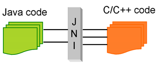
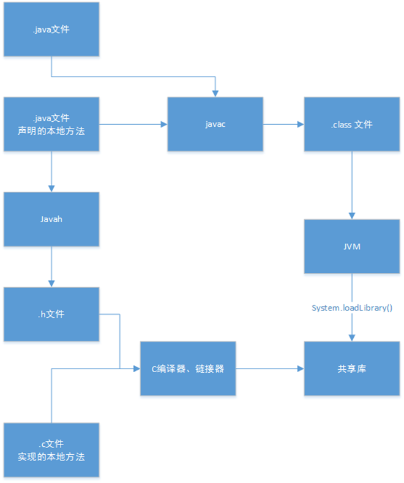

[未完待续](https://blog.csdn.net/z1002137615/article/details/50943869)

## Static 

### static的用途

&emsp;&emsp;<java编程思想>中有这样一句话

> static方法就是没有this的方法。在static方法内部不能调用非静态方法，反过来是可以的。而且可以在没有创建
> 任何对象的前提下，仅仅通过类本身来调用static方法。这实际上正是static方法的主要用途。

&emsp;&emsp;这段话虽然只是说明了static方法的特殊之处，但是可以看出static关键字的基本作用，简而言之，一句话来描述就是：

&emsp;&emsp;`方便在没有创建对象的情况下来进行调用（方法/变量）`

&emsp;&emsp;很显然，被static关键字修饰的方法或者变量不需要依赖于对象来进行访问，只要类被加载了，就可以通过类名去进行访问。

&emsp;&emsp;static可以用来修饰类的成员方法、类的成员变量，另外可以编写static代码块来优化程序性能。

#### static修饰方法

&emsp;&emsp;static方法一般称作静态方法，由于静态方法不依赖于任何对象就可以进行访问，因此对于静态方法来说，是没有this的，因为它不依附于任何对象，既然都没有对象，就谈不上this了。并且由于这个特性，在静态方法中不能访问类的非静态成员变量和非静态成员方法，因为非静态成员方法/变量都是必须依赖具体的对象才能够被调用。

&emsp;&emsp;但是要注意的是，虽然在静态方法中不能访问非静态成员方法和非静态成员变量，但是在非静态成员方法中是可以访问静态成员方法/变量的。

&emsp;&emsp;而对于非静态成员方法，它访问静态成员方法/变量显然是毫无限制的。

&emsp;&emsp;因此，如果说想在不创建对象的情况下调用某个方法，就可以将这个方法设置为static。我们最常见的static方法就是main方法，至于为什么main方法必须是static的，现在就很清楚了。因为程序在执行main方法的时候没有创建任何对象，因此只有通过类名来访问。

&emsp;&emsp;有这么一个说法构造器是可以是静态的，这个说法是错误的，因为`构造器里面隐藏有this关键字`，但是static方法里面不能有this关键字，this是指调用当前方法的对象，而静态方法不属于任何对象。构造器只负责初始化，不负责创建实例

#### staitc修饰成员变量

&emsp;&emsp;static变量也称作静态变量，静态变量和非静态变量的区别是：静态变量被所有的对象所共享，在内存中只有一个副本，它当且仅当在类初次加载时会被初始化。而非静态变量是对象所拥有的，在创建对象的时候被初始化，存在多个副本，各个对象拥有的副本互不影响。

&emsp;&emsp;static成员变量的初始化顺序按照定义的顺序进行初始化。

#### 修饰代码块

&emsp;&emsp;static关键字还有一个比较关键的作用就是 用来形成静态代码块以优化程序性能。static块可以置于类中的任何地方，类中可以有多个static块。在类初次被加载的时候，会按照static块的顺序来执行每个static块，并且只会执行一次。

&emsp;&emsp;为什么说static块可以用来优化程序性能，是因为它的特性:只会在类加载的时候执行一次。下面看个例子:

```
class Person{
    private Date birthDate;
     
    public Person(Date birthDate) {
        this.birthDate = birthDate;
    }
     
    boolean isBornBoomer() {
        Date startDate = Date.valueOf("1946");
        Date endDate = Date.valueOf("1964");
        return birthDate.compareTo(startDate)>=0 && birthDate.compareTo(endDate) < 0;
    }
}
````

&emsp;&emsp;isBornBoomer是用来这个人是否是1946-1964年出生的，而每次isBornBoomer被调用的时候，都会生成startDate和birthDate两个对象，造成了空间浪费，如果改成这样效率会更好：

````
class Person{
    private Date birthDate;
    private static Date startDate,endDate;
    static{
        startDate = Date.valueOf("1946");
        endDate = Date.valueOf("1964");
    }
     
    public Person(Date birthDate) {
        this.birthDate = birthDate;
    }
     
    boolean isBornBoomer() {
        return birthDate.compareTo(startDate)>=0 && birthDate.compareTo(endDate) < 0;
    }
}
````

## static存在的误区

### static关键字会改变类中成员的访问权限吗？
&emsp;&emsp;在Java中能够影响到访问权限的只有private、public、protected（包括包访问权限）这几个关键字。

### 能通过this访问静态成员变量吗？

````
public class Main {　　
    static int value = 33;
 
    public static void main(String[] args) throws Exception{
        new Main().printValue();
    }
 
    private void printValue(){
        int value = 3;
        System.out.println(this.value);
    }
}
````

&emsp;&emsp;这里面主要考察队this和static的理解。this代表什么？this代表当前对象，那么通过new Main()来调用printValue的话，当前对象就是通过new Main()生成的对象。而static变量是被对象所享有的，因此在printValue中的this.value的值毫无疑问是33。在printValue方法内部的value是局部变量，根本不可能与this关联，所以输出结果是33。在这里永远要记住一点：静态成员变量虽然独立于对象，但是不代表不可以通过对象去访问，所有的静态方法和静态变量都可以通过对象访问（只要访问权限足够）。

### static能作用于局部变量么？

&emsp;&emsp;但是在Java中切记：static是不允许用来修饰局部变量。不要问为什么，这是Java语法的规定。

&emsp;&emsp;static 变量是给类用的。这样类初始化的时候，就会给static进行初始化.如果你在方法里面定义一个static。这时候编译器就不知道你这个变量怎么初始化了这个是和java的设计相关的。java全是面向对象设计的，单独一个方法不能持有一块空间。

## 总结

&emsp;&emsp;static可以修饰方法，修饰成员变量，修饰代码块，static内部不能调用非静态方法，可以在不创建对象的情况下，通过类本身来调用static方法和变量。被static修饰的方法、成员变量、代码块在类加载的时候加载，他是被所有的实例对象共享
````
栈内存：局部变量和对象的引用变量；
堆内存：对象；
````

&emsp;&emsp;Static是在堆内存的数据区

&emsp;&emsp;修饰方法时，应为static修饰的方法是属于类的，不需要通过对象进行调用，所以static方法里面没有`this关键字，所以同时也不能调用非静态变量和方法。Main方法`

&emsp;&emsp;修饰变量
&emsp;&emsp;静态变量是被所有的对象所共享的，在内存只有一份，是在类的加载而加载的。而非静态变量是属于实例对象的，在内存中有多个备份，创建的对象的时候初始化，存在多个副本，而且各个副本互不影响

&emsp;&emsp;修饰代码块
&emsp;&emsp;用来形成静态代码块以优化程序性能。static块可以置于类中的任何地方，类中可以有多个static块。在类初次被加载的时候，会按照static块的顺序来执行每个static块，并且只会执行一次。

&emsp;&emsp;在单例模式中会用到static，详细请见同目录下的单例模式详解[单例模式](https://github.com/only-wjt/java/blob/master/basic/Singleton.md)


## abstract

&emsp;&emsp;使用了abstract关键字的类就是抽象类，使用了abstract关键字的方法就是抽象方法。按照常理来说，抽象类会包含一个以上的抽象方法。言下之意，你非要让一个抽象类不包含抽象方法，也是可以的。但是只要包含了一个抽象方法，这个类就必须是抽象类。抽象类（抽象方法）通常都是继承时会用的到，是java多态性的体现。

&emsp;&emsp;创建抽象类和方法有时对我们非常有用，因为它们使一个类的抽象变成明显的事实，可明确告诉用户和编译器自己打算如何用它。

&emsp;&emsp;abstract用法其实比较简单：

````
abstract class Instrument4 {
	int i; // storage allocated for each
	public abstract void play();
	public String what() {
	    return "Instrument4";
    }
    public abstract void adjust();
}
 
class Wind4 extends Instrument4 {
	public void play() {
	    System.out.println("Wind4.play()");
	}
	public String what() {
		return "Wind4"; 
	}
	public void adjust() {}
}
 
class Percussion4 extends Instrument4 {
	public void play() {
	    System.out.println("Percussion4.play()");
	}
	public String what() {
		return "Percussion4";
	}
	public void adjust() {}
}
 
class Stringed4 extends Instrument4 {
	public void play() {
	    System.out.println("Stringed4.play()");
	}
	public String what() {
		return "Stringed4";
	}
	public void adjust() {}
}
 
class Brass4 extends Wind4 {
	public void play() {
	    System.out.println("Brass4.play()");
	}
	public void adjust() {
	    System.out.println("Brass4.adjust()");
	}
}
 
class Woodwind4 extends Wind4 {
	public void play() {
	    System.out.println("Woodwind4.play()");
	}
	public String what() {
		return "Woodwind4"; 
	}
}
 
class Music4 {
	// Doesn't care about type, so new types
	// added to the system still work right:
	static void tune(Instrument4 i) {
		// ...
		i.play();
	}
	static void tuneAll(Instrument4[] e) {
		for(int i = 0; i < e.length; i++)
		    tune(e[i]);
	}
	public static void main(String[] args) {
		Instrument4[] orchestra = new Instrument4[5];
		int i = 0;
		// Upcasting during addition to the array:
		orchestra[i++] = new Wind4();
		orchestra[i++] = new Percussion4();
		orchestra[i++] = new Stringed4();
		orchestra[i++] = new Brass4();
		orchestra[i++] = new Woodwind4();
		tuneAll(orchestra);
	}
} 

````

&emsp;&emsp;注意点：

&emsp;&emsp;1.一个抽象类不一定有抽象方法，但只要有一个抽象方法就一定是抽象类。

&emsp;&emsp;2.抽象类不可创建新对象。但是抽象类允许有构造方法。（子类可以继承构造方法）

&emsp;&emsp;3.子类继承抽象类必须实现其中抽象方法，除非子类也是抽象类。

&emsp;&emsp;4.抽象类的非抽象方法都可以被正常调用。调用方式包括通过子类调用，直接调用static方法等。

&emsp;&emsp;5.abstract 不能与private、static、final、native、synchronized共用。（相互之间矛盾，直接编译报错）

## interface
&emsp;&emsp;接口是抽象方法的集合。如果一个类实现了某个接口，那么它就继承了这个接口的抽象方法。这就像契约模式，如果实现了这个接口，那么就必须确保使用这些方法。接口只是一种形式，接口自身不能做任何事情。

### 接口和抽象类的区别


### 什么时候使用抽象类和接口

&emsp;&emsp;如果你拥有一些方法并且想让它们中的一些有默认实现，那么使用抽象类吧。

&emsp;&emsp;如果你想实现多重继承，那么你必须使用接口。由于Java不支持多继承，子类不能够继承多个类，但可以实现多个接口。因此你就可以使用接口来解决它。

&emsp;&emsp;如果基本功能在不断改变，那么就需要使用抽象类。如果不断改变基本功能并且使用接口，那么就需要改变所有实现了该接口的类。


## final[转载](http://www.cnblogs.com/dolphin0520/p/3736238.html)

&emsp;&emsp;前言：final关键字一般会在匿名内部类用到，而且，我们常用的String也是用fianl修饰的

### final关键字的基本用法

&emsp;&emsp;在Java中，final关键字可以用来修饰类、方法和变量（包括成员变量和局部变量）。

#### final用来修饰类

&emsp;&emsp;当用final修饰一个类时，表明这个类不能被继承。也就是说，如果一个类你永远不会让他被继承，就可以用final进行修饰。final类中的成员变量可以根据需要设为final，但是要注意`final类中的所有成员方法都会被隐式地指定为final方法。`

&emsp;&emsp;`在使用final修饰类的时候，要注意谨慎选择，除非这个类真的在以后不会用来继承或者出于安全的考虑，尽量不要将类设计为final类。`

#### final用来修饰方法

&emsp;&emsp;<java编程思想>

> 使用final方法的原因有两个。第一个原因是把方法锁定，以防任何继承类修改它的含义；第二个原因是效率。在早期的Java实现版本中，会将final方法
> 转为内嵌调用。但是如果方法过于庞大，可能看不到内嵌调用带来的任何性能提升。在最近的Java版本中，不需要使用final方法进行这些优化了。

&emsp;&emsp;因此，如果只有在想明确禁止 该方法在子类中被覆盖的情况下才将方法设置为final的。

&emsp;&emsp;注：类的private方法会隐式地被指定为final方法。

#### fianl用来修饰变量

&emsp;&emsp;修饰变量是final用得最多的地方，也是本文接下来要重点阐述的内容。首先了解一下final变量的基本语法：

&emsp;&emsp;对于一个final变量，`如果是基本数据类型的变量，则其数值一旦在初始化之后便不能更改；``如果是引用类型的变量，则在对其初始化之后便不能再让其指向另一个对象。`


### 深入了解final关键字

#### 类的final变量和普通变量有什么区别？

&emsp;&emsp;当用final作用于类的成员变量时，成员变量（注意是类的成员变量，局部变量只需要保证在使用之前被初始化赋值即可）必须在定义时或者构造器中进行初始化赋值，而且final变量一旦被初始化赋值之后，就不能再被赋值了。

````
public class Test {
    public static void main(String[] args)  {
        String a = "hello2"; 
        final String b = "hello";
        String d = "hello";
        String c = b + 2; 
        String e = d + 2;
        System.out.println((a == c));
        System.out.println((a == e));
    }
}
````

````
true
false
````

&emsp;&emsp;为什么第一个比较结果为true，而第二个比较结果为fasle。这里面就是final变量和普通变量的区别了，当final变量是基本数据类型以及String类型时，如果在编译期间能知道它的确切值，则编译器会把它当做编译期常量使用。也就是说在用到该final变量的地方，相当于直接访问的这个常量，不需要在运行时确定。这种和C语言中的宏替换有点像。因此在上面的一段代码中，由于变量b被final修饰，因此会被当做编译器常量，所以在使用到b的地方会直接将变量b 替换为它的  值。而对于变量d的访问却需要在运行时通过链接来进行。想必其中的区别大家应该明白了，不过要注意，只有在编译期间能确切知道final变量值的情况下，编译器才会进行这样的优化，比如下面的这段代码就不会进行优化：

````
public class Test {
    public static void main(String[] args)  {
        String a = "hello2"; 
        final String b = getHello();
        String c = b + 2; 
        System.out.println((a == c));
 
    }
     
    public static String getHello() {
        return "hello";
    }
}
````

#### 被final修饰的引用变量指向的对象内容可变吗？(可变)

````
public class Test {
    public static void main(String[] args)  {
        final MyClass myClass = new MyClass();
        System.out.println(++myClass.i);
 
    }
}
 
class MyClass {
    public int i = 0;
}
````

&emsp;&emsp;这段代码可以顺利编译通过并且有输出结果，输出结果为1。这说明引用变量被final修饰之后，虽然不能再指向其他对象，但是它指向的对象的内容是可变的。

#### final和static

&emsp;&emsp;很多时候会容易把static和final关键字混淆，static作用于成员变量用来表示只保存一份副本，而final的作用是用来保证变量不可变。看下面这个例子：

````
public class Test {
    public static void main(String[] args)  {
        MyClass myClass1 = new MyClass();
        MyClass myClass2 = new MyClass();
        System.out.println(myClass1.i);
        System.out.println(myClass1.j);
        System.out.println(myClass2.i);
        System.out.println(myClass2.j);
 
    }
}
 
class MyClass {
    public final double i = Math.random();
    public static double j = Math.random();
}
````
&emsp;&emsp;运行这段代码就会发现，每次打印的两个j值都是一样的，而i的值却是不同的。从这里就可以知道final和static变量的区别了。

#### 匿名内部类中使用的外部局部变量为什么只能是final变量？

见内部类（暂时未完成）

#### 关于final参数的问题

&emsp;&emsp;关于网上流传的”当你在方法中不需要改变作为参数的对象变量时，明确使用final进行声明，会防止你无意的修改而影响到调用方法外的变量“这句话，我个人理解这样说是不恰当的。

&emsp;&emsp;因为无论参数是基本数据类型的变量还是引用类型的变量，使用final声明都不会达到上面所说的效果。

````
  public class Test {
    public static void main(String[] args)  {
        MyClass myClass = new MyClass();
        StringBuffer buffer = new StringBuffer("hello");
        myClass.changeValue(buffer);
        System.out.println(buffer.toString());
    }
}
 
class MyClass {
     
    void changeValue(final StringBuffer buffer) {
        buffer.append("world");
    }
}
````

&emsp;&emsp;运行这段代码就会发现输出结果为 helloworld。很显然，用final进行修饰并没有阻止在changeValue中改变buffer指向的对象的内容。有人说假如把final去掉了，万一在changeValue中让buffer指向了其他对象怎么办。有这种想法的朋友可以自己动手写代码试一下这样的结果是什么，如果把final去掉了，然后在changeValue中让buffer指向了其他对象，也不会影响到main方法中的buffer，`原因在于java采用的是值传递，对于引用变量，传递的是引用的值，也就是说让实参和形参同时指向了同一个对象，因此让形参重新指向另一个对象对实参并没有任何影响。`

#### 下面总结了一些使用final关键字的好处

&emsp;&emsp;final关键字提高了性能。JVM和Java应用都会缓存final变量。
&emsp;&emsp;final变量可以安全的在多线程环境下进行共享，而不需要额外的同步开销。
&emsp;&emsp;使用final关键字，JVM会对方法、变量及类进行优化。

#### 关于final的重要知识点

&emsp;&emsp;final关键字可以用于成员变量、本地变量、方法以及类。
&emsp;&emsp;final成员变量必须在声明的时候初始化或者在构造器中初始化，否则就会报编译错误。
&emsp;&emsp;你不能够对final变量再次赋值。
&emsp;&emsp;本地变量必须在声明时赋值。
&emsp;&emsp;在匿名类中所有变量都必须是final变量。
&emsp;&emsp;final方法不能被重写。
&emsp;&emsp;final类不能被继承。
&emsp;&emsp;final关键字不同于finally关键字，后者用于异常处理。
&emsp;&emsp;final关键字容易与finalize()方法搞混，后者是在Object类中定义的方法，是在垃圾回收之前被JVM调用的方法。
&emsp;&emsp;接口中声明的所有变量本身是final的。
&emsp;&emsp;final和abstract这两个关键字是反相关的，final类就不可能是abstract的。
&emsp;&emsp;final方法在编译阶段绑定，称为静态绑定(static binding)。
&emsp;&emsp;没有在声明时初始化final变量的称为空白final变量(blank final variable)，它们必须在构造器中初始化，或者调用this()初始化。不这么做的话，编译器会报错“final变量(变量名)需要进行初始化”。
&emsp;&emsp;将类、方法、变量声明为final能够提高性能，这样JVM就有机会进行估计，然后优化。
&emsp;&emsp;按照Java代码惯例，final变量就是常量，而且通常常量名要大写


## finally[详细见这里](https://blog.csdn.net/moliilom/article/details/50909096)
&emsp;&emsp;finally作为异常处理的一部分，它只能用在try/catch语句中，`并且附带一个语句块，表示这段语句最终一定会被执行（不管有没有抛出异常），`经常被用在需要释放资源的情况下。

&emsp;&emsp;之前在写爬虫的时候数据库连接的频率很高，有时候数据处理的不好，sql报错后，抛出异常但后边的数据库连接没有断开。导致最后数据库连接数过大，不让再连接了（因为是个人库，所以直接重启了一下）。这个释放数据库连接的操作就可以用finally来进行。

&emsp;&emsp;异常处理是大多数编程语言需要遇到的问题,java中的try-catch块和C++差不多,但是java中却多了一个finally块。这个块无论异常是否发生都会执行。但是如果在try块中或者在catch块中有return语句,那会先执行return语句吗?答案是否定的,程序会先执行finally语句块,然后再执行try块或catch块的return语句(这里先假设finally块中没有return语句,finally块中有return语句的下面再讨论)。

&emsp;&emsp;下面有一道题：

````
public static int func (){
    try{
        return 1;
    }catch (Exception e){
        return 2;
    }finally{
        return 3;
    }
}
````

&emsp;&emsp;最终输出3。


&emsp;&emsp;finally的优先覆盖
&emsp;&emsp;这里还需要指出，finally子句有最高的控制流返回权，其可以覆盖try、catch块内的任意Exception值、return值。如下的函数，将会返回12，而不是10。

````
public static int getMonthsInYear(){
    try{
        return 10;
    } finally {
        return 12;
    }
}
````

&emsp;&emsp;同样地，如下函数，最后并不会抛出异常，而是返回值。

````
public static int getMonthsInYear(){
    try{
        throw new RuntimeException();
    } finally {
        return 12;
    }
}
````

&emsp;&emsp;再对比这个函数，却抛出异常，并不返回值。

````
public static int getMonthsInYear(){
    try{
        return 12;          
    } finally {
        throw new RuntimeException();
    }
}
````

## finalize()方法

### Java垃圾回收机制

&emsp;&emsp;Java有垃圾回收期负责回收无用对象占据的内存空间。但也有特殊情况:假定你的对象(并非使用new)获得了一块“特殊”的内存区域，由于垃圾回收期只知道释放那些经由new分配的内存，所以它不知道该如何释放该对象的这块“特殊”内存。
&emsp;&emsp;Java允许在类中定义一个名为finalize()方法。一旦垃圾回收期准备好释放对象占用的内存空间，首先调用其finalize()方法，`并且在下一次垃圾回收动作发生时，才会真正回收对象占用的内存。`在Java中，对象并非总是被垃圾回收，只要程序没有濒临内存空间用完的那一刻，对象占用的空间就中也得不到释放。如果程序执行结束，并且垃圾回收器一直没有释放创建的对象，程序结束退出后资源也会全部返回给操作系统。
&emsp;&emsp;`这个垃圾回收策略避免了频繁垃圾回收造成的开销，Java虚拟机并未面临内存耗尽的情形，它是不会浪费时间去执行垃圾回收以恢复内存的`


### finalize方法是Object提供的的实例方法，使用规则如下：

&emsp;&emsp;当对象不再被任何对象引用时，GC会调用该对象的finalize()方法

&emsp;&emsp;finalize()是Object的方法，子类可以覆盖这个方法来做一些系统资源的释放或者数据的清理

&emsp;&emsp;可以在finalize()让这个对象再次被引用，避免被GC回收；但是最常用的目的还是做cleanup

&emsp;&emsp;Java不保证这个finalize()一定被执行；但是保证调用finalize的线程没有持有任何user-visible同步锁。

&emsp;&emsp;在finalize里面抛出的异常会被忽略，同时方法终止。

&emsp;&emsp;当finalize被调用之后，JVM会再一次检测这个对象是否能被存活的线程访问得到，如果不是，则清除该对象。也就是finalize只能被调用一次；也就是说，`覆盖了finalize方法的对象需要经过两个GC周期才能被清除。`

### finalize机制本身就是存在问题的。

&emsp;&emsp;finalize机制可能会导致性能问题，死锁和线程挂起。

&emsp;&emsp;finalize中的错误可能导致内存泄漏；如果不在需要时，也没有办法取消垃圾回收；并且没有指定不同执行finalize对象的执行顺序。此外，没有办法保证finlize的执行时间。

&emsp;&emsp;遇到这些情况，对象调用finalize方法只有被无限期延后。

&emsp;&emsp;Java9中finalize方法已经被废弃。

&emsp;&emsp;占有非堆资源的对象实例，类应该提供一个方法以明确释放这些资源，如果合适的话他们也应该实现AutoCloseable接口。


## Native[详细见这里](https://www.cnblogs.com/Qian123/p/5702574.html)

>public native int hashCode();

&emsp;&emsp;为什么会有native关键字的出现

### 认识 native 即 JNI,Java Native Interface

&emsp;&emsp;凡是一种语言，都希望是纯。比如解决某一个方案都喜欢就单单这个语言来写即可。Java平台有个用户和本地C代码进行互操作的API，称为Java Native Interface (Java本地接口)。



### 用 Java 调用 C 的“Hello，JNI”

#### 1.创建一个Java类，里面包含着一个 native 的方法和加载库的方法 loadLibrary。

#### 2、运行javah，得到包含该方法的C声明头文件.h

#### 3、根据头文件，写C实现本地方法。

### 4、生成dll共享库，然后Java程序load库，调用即可。



### 其他介绍

&emsp;&emsp;native是与C++联合开发的时候用的！java自己开发不用的！

&emsp;&emsp;使用native关键字说明这个方法是原生函数，也就是这个方法是用C/C++语言实现的，并且被编译成了DLL，由java去调用。
&emsp;&emsp;这些函数的实现体在DLL中，JDK的源代码中并不包含，你应该是看不到的。对于不同的平台它们也是不同的。这也是java的底层机制，实际上java就是在不同的平台上调用不同的native方法实现对操作系统的访问的。

&emsp;&emsp;1。native 是用做java 和其他语言（如c++）进行协作时用的也就是native 后的函数的实现不是用java写的
&emsp;&emsp;2。既然都不是java，那就别管它的源代码了，呵呵

&emsp;&emsp;native的意思就是通知操作系统，这个函数你必须给我实现，因为我要使用。所以native关键字的函数都是操作系统实现的，java只能调用。

&emsp;&emsp;java是跨平台的语言，既然是跨了平台，所付出的代价就是牺牲一些对底层的控制，而java要实现对底层的控制，就需要一些其他语言的帮助，这个就是native的作用了

&emsp;&emsp;Java不是完美的，Java的不足除了体现在运行速度上要比传统的C++慢许多之外，Java无法直接访问到操作系统底层（如系统硬件等)，为此Java使用native方法来扩展Java程序的功能。
&emsp;&emsp;可以将native方法比作Java程序同Ｃ程序的接口，其实现步骤：
&emsp;&emsp;１、在Java中声明native()方法，然后编译；
&emsp;&emsp;２、用javah产生一个.h文件；
&emsp;&emsp;３、写一个.cpp文件实现native导出方法，其中需要包含第二步产生的.h文件（注意其中又包含了JDK带的jni.h文件）；
&emsp;&emsp;４、将第三步的.cpp文件编译成动态链接库文件；
&emsp;&emsp;５、在Java中用System.loadLibrary()方法加载第四步产生的动态链接库文件，这个native()方法就可以在Java中被访问了。

&emsp;&emsp;JAVA本地方法适用的情况 
&emsp;&emsp;1.为了使用底层的主机平台的某个特性，而这个特性不能通过JAVA API访问

&emsp;&emsp;2.为了访问一个老的系统或者使用一个已有的库，而这个系统或这个库不是用JAVA编写的

&emsp;&emsp;3.为了加快程序的性能，而将一段时间敏感的代码作为本地方法实现。


## super

&emsp;&emsp;super关键字表示对某个类的父类的引用。一般而言，super有两种通用形式：第一种用来访问被子类的成员隐藏的父类成员；第二种则是可以调用父类的构造函数。接下来说一下两种使用形式的方法和规则。

&emsp;&emsp;第一种：如子类和父类有同名的成员变量或方法，则父类的成员将会被覆盖，此时可用下面的方式来引用父类的成员：

````
super.<成员变量名>
super.<成员方法名>
````

&emsp;&emsp;在Java语言中，`用过继承关系实现对成员的访问是按照最近匹配原则进行的，`规则如下：

&emsp;&emsp;（1）在子类中访问成员变量和方法时将优先查找是否在本类中已经定义，如果该成员在本类中存在，则使用本类的，否则，按照继承层次的顺序往父类查找，如果未找到，继续逐层向上到其祖先类查找。

&emsp;&emsp;（2）super特指访问父类的成员，使用super首先到直接父类查找匹配成员，如果未找到，再逐层向上到祖先类查找。

&emsp;&emsp;第二种：`子类可以通过super关键字调用父类中定义的构造方法，`格式如下：

&emsp;&emsp;super(调用参数列表),`其中调用参数列表必须和父类的某个构造函数方法的参数列表完全匹配。`

&emsp;&emsp;子类与其直接父类之间的构造方法存在约束关系，有以下几条重要原则：

&emsp;&emsp;（1）按继承关系，构造方法是从顶向下进行调用的。

&emsp;&emsp;（2）如果子类没有构造方法，则它默认调用父类无参的构造方法，如果父类中没有无参数的构造方法，则将产生错误。

&emsp;&emsp;（3）`如果子类有构造方法，那么创建子类的对象时，先执行父类的构造方法，再执行子类的构造方法。`子类的构造函数默认第一行会默认调用父类无参的构造函数，隐式语句

&emsp;&emsp;（4）如果子类有构造方法，但子类的构造方法中没有super关键字，则系统默认执行该构造方法时会产生super()代码，即该构造方法会调用父类无参数的构造方法。

&emsp;&emsp;（5）对于父类中包含有参数的构造方法，子类可以通过在自己的构造方法中使用super关键字来引用，而且必须是子类构造函数方法中的第一条语句。

&emsp;&emsp;（6）Java语言中规定当一个类中含有一个或多个有参构造方法，系统不提供默认的构造方法（即不含参数的构造方法），所以当父类中定义了多个有参数构造方法时，应考虑写一个无参数的构造方法，以防子类省略super关键字时出现错误。


## this

### this关键字主要有三个应用：
&emsp;&emsp; (1)this调用本类中的属性，也就是类中的成员变量；
 &emsp;&emsp;(2)this调用本类中的其他方法；
 &emsp;&emsp;(3)this调用本类中的其他构造方法，调用时要放在构造方法的首行。

 

### 引用成员变量
 
````
Public Class Student { 
 String name; //定义一个成员变量name
 private void SetName(String name) { //定义一个参数(局部变量)name
  this.name=name; //将局部变量的值传递给成员变量
 }
}
````

&emsp;&emsp;this这个关键字其代表的就是对象中的成员变量或者方法。也就是说，`如果在某个变量前面加上一个this关键字，其指的就是这个对象的成员变量或者方法，`而不是指成员方法的形式参数或者局部变量。

&emsp;&emsp;为此在上面这个代码中，this.name代表的就是对象中的成员变量，又叫做对象的属性，而后面的name则是方法的形式参数，代码this.name=name就是将形式参数的值传递给成员变量。
 

### 调用类的构造方法

````
public class Student { //定义一个类，类的名字为student。 
 public Student() { //定义一个方法，名字与类相同故为构造方法
  this(“Hello!”);
 }
 public Student(String name) { //定义一个带形式参数的构造方法
 }
}
````

&emsp;&emsp;在一个Java类中，`其方法可以分为成员方法和构造方法`两种。

&emsp;&emsp;构造方法是一个与类同名的方法，在Java类中必须存在一个构造方法。

&emsp;&emsp;如果在代码中没有显示的体现构造方法的话，那么编译器在编译的时候会自动添加一个没有形式参数的构造方法。这个构造方法跟普通的成员方法还是有很多不同的地方。

&emsp;&emsp;如构造方法一律是没有返回值的，而且也不用void关键字来说明这个构造方法没有返回值。而普通的方法可以有返回值、也可以没有返回值，程序员可以根据自己的需要来定义。不过如果普通的方法没有返回值的话，那么一定要在方法定义的时候采用void关键字来进行说明。

&emsp;&emsp;其次构造方法的名字有严格的要求，即必须与类的名字相同。也就是说，Java编译器发现有个方法与类的名字相同才把其当作构造方法来对待。

&emsp;&emsp;而对于普通方法的话，则要求不能够与类的名字相同，而且多个成员方法不能够采用相同的名字。在一个类中可以存在多个构造方法，这些构造方法都采用相同的名字，只是形式参数不同。Java语言就凭形式参数不同来判断调用那个构造方法。


### 返回对象的值

&emsp;&emsp;this关键字除了可以引用变量或者成员方法之外，还有一个重大的作用就是返回类的引用。

&emsp;&emsp;如在代码中，`可以使用return this，来返回某个类的引用。``此时这个this关键字就代表类的名称。`如代码在上面student类中，那么代码代表的含义就是return student。可见，这个this关键字除了可以引用变量或者成员方法之外，还可以作为类的返回值，这才是this关键字最引人注意的地方。

````
public Class Student {

 String name; //定义一个成员变量name

 private void SetName(String name) { //定义一个参数(局部变量)name

 this.name=name; //将局部变量的值传递给成员变量

 

 }

Return this

}
````


## synchronized

&emsp;&emsp;因为synchronized关键字涉及到锁的概念，所以先来了解一些相关的锁知识。

&emsp;&emsp;java的内置锁：每个java对象都可以用做一个实现同步的锁，这些锁成为内置锁。线程进入同步代码块或方法的时候会自动获得该锁，在退出同步代码块或方法时会释放该锁。获得内置锁的唯一途径就是进入这个锁的保护的同步代码块或方法。

&emsp;&emsp;java内置锁是一个互斥锁，这就是意味着最多只有一个线程能够获得该锁，当线程A尝试去获得线程B持有的内置锁时，线程A必须等待或者阻塞，知道线程B释放这个锁，如果B线程不释放这个锁，那么A线程将永远等待下去。

&emsp;&emsp;java的对象锁和类锁：java的对象锁和类锁在锁的概念上基本上和内置锁是一致的，但是，两个锁实际是有很大的区别的，对象锁是用于对象实例方法，或者一个对象实例上的，类锁是用于类的静态方法或者一个类的class对象上的。我们知道，类的对象实例可以有很多个，但是每个类只有一个class对象，所以不同对象实例的对象锁是互不干扰的，但是每个类只有一个类锁。但是有一点必须注意的是，其实类锁只是一个概念上的东西，并不是真实存在的，它只是用来帮助我们理解锁定实例方法和静态方法的区别的

&emsp;&emsp;上面已经对锁的一些概念有了一点了解，下面探讨synchronized关键字的用法。

&emsp;&emsp;synchronized的用法：synchronized修饰方法和synchronized修饰代码块。

&emsp;&emsp;下面分别分析这两种用法在对象锁和类锁上的效果。

&emsp;&emsp;对象锁的synchronized修饰方法和代码块：

````
public class TestSynchronized 
{  
    public void test1() 
    {  
         synchronized(this) 
         {  
              int i = 5;  
              while( i-- > 0) 
              {  
                   System.out.println(Thread.currentThread().getName() + " : " + i);  
                   try 
                   {  
                        Thread.sleep(500);  
                   } 
                   catch (InterruptedException ie) 
                   {  
                   }  
              }  
         }  
    }  
    public synchronized void test2() 
    {  
         int i = 5;  
         while( i-- > 0) 
         {  
              System.out.println(Thread.currentThread().getName() + " : " + i);  
              try 
              {  
                   Thread.sleep(500);  
              } 
              catch (InterruptedException ie) 
              {  
              }  
         }  
    }  
    public static void main(String[] args) 
    {  
         final TestSynchronized myt2 = new TestSynchronized();  
         Thread test1 = new Thread(  new Runnable() {  public void run() {  myt2.test1();  }  }, "test1"  );  
         Thread test2 = new Thread(  new Runnable() {  public void run() { myt2.test2();   }  }, "test2"  );  
         test1.start();;  
         test2.start();  
//         TestRunnable tr=new TestRunnable();
//         Thread test3=new Thread(tr);
//         test3.start();
    } 
}
 

 

test2 : 4
test2 : 3
test2 : 2
test2 : 1
test2 : 0
test1 : 4
test1 : 3
test1 : 2
test1 : 1
test1 : 0

````

&emsp;&emsp;上述的代码，第一个方法时用了同步代码块的方式进行同步，传入的对象实例是this，表明是当前对象，当然，如果需要同步其他对象实例，也不可传入其他对象的实例；第二个方法是修饰方法的方式进行同步。因为第一个同步代码块传入的this，所以两个同步代码所需要获得的对象锁都是同一个对象锁，下面main方法时分别开启两个线程，分别调用test1和test2方法，那么两个线程都需要获得该对象锁，另一个线程必须等待。上面也给出了运行的结果可以看到：直到test2线程执行完毕，释放掉锁，test1线程才开始执行。（可能这个结果有人会有疑问，代码里面明明是先开启test1线程，为什么先执行的是test2呢？这是因为java编译器在编译成字节码的时候，会对代码进行一个重排序，也就是说，编译器会根据实际情况对代码进行一个合理的排序，编译前代码写在前面，在编译后的字节码不一定排在前面，所以这种运行结果是正常的， 这里是题外话，最主要是检验synchronized的用法的正确性）,`获得是的对象锁，当一个线程在使用时，这个对象的锁就被当前线程拿到了，等当前线程完成任务时，就会释放锁，另一个线程才会拿到此对象锁`

&emsp;&emsp;如果我们把test2方法的synchronized关键字去掉，执行结果会如何呢？

````
test1 : 4
test2 : 4
test2 : 3
test1 : 3
test1 : 2
test2 : 2
test2 : 1
test1 : 1
test2 : 0
test1 : 0
````

&emsp;&emsp;上面是执行结果，我们可以看到，结果输出是交替着进行输出的，这是因为，某个线程得到了对象锁，但是另一个线程还是可以访问没有进行同步的方法或者代码。进行了同步的方法（加锁方法）和没有进行同步的方法（普通方法）是互不影响的，一个线程进入了同步方法，得到了对象锁，其他线程还是可以访问那些没有同步的方法（普通方法）。这里涉及到内置锁的一个概念（此概念出自java并发编程实战第二章）：对象的内置锁和对象的状态之间是没有内在的关联的，虽然大多数类都将内置锁用做一种有效的加锁机制，但对象的域并不一定通过内置锁来保护。当获取到与对象关联的内置锁时，并不能阻止其他线程访问该对象，当某个线程获得对象的锁之后，只能阻止其他线程获得同一个锁。之所以每个对象都有一个内置锁，是为了免去显式地创建锁对象。

&emsp;&emsp;`所以synchronized只是一个内置锁的加锁机制，当某个方法加上synchronized关键字后，就表明要获得该内置锁才能执行，并不能阻止其他线程访问不需要获得该内置锁的方法。`


&emsp;&emsp;类锁的修饰（静态）方法和代码块：

````
public class TestSynchronized 
{  
    public void test1() 
    {  
         synchronized(TestSynchronized.class) 
         {  
              int i = 5;  
              while( i-- > 0) 
              {  
                   System.out.println(Thread.currentThread().getName() + " : " + i);  
                   try 
                   {  
                        Thread.sleep(500);  
                   } 
                   catch (InterruptedException ie) 
                   {  
                   }  
              }  
         }  
    }  
    public static synchronized void test2() 
    {  
         int i = 5;  
         while( i-- > 0) 
         {  
              System.out.println(Thread.currentThread().getName() + " : " + i);  
              try 
              {  
                   Thread.sleep(500);  
              } 
              catch (InterruptedException ie) 
              {  
              }  
         }  
    }  
    public static void main(String[] args) 
    {  
         final TestSynchronized myt2 = new TestSynchronized();  
         Thread test1 = new Thread(  new Runnable() {  public void run() {  myt2.test1();  }  }, "test1"  );  
         Thread test2 = new Thread(  new Runnable() {  public void run() { TestSynchronized.test2();   }  }, "test2"  );  
         test1.start();  
         test2.start();  
//         TestRunnable tr=new TestRunnable();
//         Thread test3=new Thread(tr);
//         test3.start();
    } 
}
 

test1 : 4
test1 : 3
test1 : 2
test1 : 1
test1 : 0
test2 : 4
test2 : 3
test2 : 2
test2 : 1
test2 : 0
````

&emsp;&emsp;其实，类锁修饰方法和代码块的效果和对象锁是一样的，因为类锁只是一个抽象出来的概念，只是为了区别静态方法的特点，因为静态方法是所有对象实例共用的，所以对应着synchronized修饰的静态方法的锁也是唯一的，所以抽象出来个类锁。其实这里的重点在下面这块代码，synchronized同时修饰静态和非静态方法

````
public class TestSynchronized 
{  
    public synchronized void test1() 
    {  
              int i = 5;  
              while( i-- > 0) 
              {  
                   System.out.println(Thread.currentThread().getName() + " : " + i);  
                   try 
                   {  
                        Thread.sleep(500);  
                   } 
                   catch (InterruptedException ie) 
                   {  
                   }  
              }  
    }  
    public static synchronized void test2() 
    {  
         int i = 5;  
         while( i-- > 0) 
         {  
              System.out.println(Thread.currentThread().getName() + " : " + i);  
              try 
              {  
                   Thread.sleep(500);  
              } 
              catch (InterruptedException ie) 
              {  
              }  
         }  
    }  
    public static void main(String[] args) 
    {  
         final TestSynchronized myt2 = new TestSynchronized();  
         Thread test1 = new Thread(  new Runnable() {  public void run() {  myt2.test1();  }  }, "test1"  );  
         Thread test2 = new Thread(  new Runnable() {  public void run() { TestSynchronized.test2();   }  }, "test2"  );  
         test1.start();  
         test2.start();  
//         TestRunnable tr=new TestRunnable();
//         Thread test3=new Thread(tr);
//         test3.start();
    } 
}
 

test1 : 4
test2 : 4
test1 : 3
test2 : 3
test2 : 2
test1 : 2
test2 : 1
test1 : 1
test1 : 0
test2 : 0
````

&emsp;&emsp;上面代码synchronized同时修饰静态方法和实例方法，但是运行结果是交替进行的，这证明了类锁和对象锁是两个不一样的锁，控制着不同的区域，它们是互不干扰的。同样，线程获得对象锁的同时，也可以获得该类锁，即同时获得两个锁，这是允许的。

 &emsp;&emsp;到这里，对synchronized的用法已经有了一定的了解。这时有一个疑问，既然有了synchronized修饰方法的同步方式，为什么还需要synchronized修饰同步代码块的方式呢？而这个问题也是synchronized的缺陷所在

 &emsp;&emsp;synchronized的缺陷：当某个线程进入同步方法获得对象锁，那么其他线程访问这里对象的同步方法时，必须等待或者阻塞，这对高并发的系统是致命的，这很容易导致系统的崩溃。如果某个线程在同步方法里面发生了死循环，那么它就永远不会释放这个对象锁，那么其他线程就要永远的等待。这是一个致命的问题。
 
&emsp;&emsp;当然同步方法和同步代码块都会有这样的缺陷，只要用了synchronized关键字就会有这样的风险和缺陷。既然避免不了这种缺陷，那么就应该将风险降到最低。这也是同步代码块在某种情况下要优于同步方法的方面。例如在某个类的方法里面：这个类里面声明了一个对象实例，SynObject so=new SynObject()；在某个方法里面调用了这个实例的方法so.testsy();但是调用这个方法需要进行同步，不能同时有多个线程同时执行调用这个方法。

&emsp;&emsp;这时如果直接用synchronized修饰调用了so.testsy();代码的方法，那么当某个线程进入了这个方法之后，这个对象其他同步方法都不能给其他线程访问了。假如这个方法需要执行的时间很长，那么其他线程会一直阻塞，影响到系统的性能。

&emsp;&emsp;如果这时用synchronized来修饰代码块：synchronized（so）{so.testsy();}，那么这个方法加锁的对象是so这个对象，跟执行这行代码的对象没有关系，当一个线程执行这个方法时，这对其他同步方法时没有影响的，因为他们持有的锁都完全不一样。

&emsp;&emsp;不过这里还有一种特例，就是上面演示的第一个例子，对象锁synchronized同时修饰方法和代码块，这时也可以体现到同步代码块的优越性，如果test1方法同步代码块后面有非常多没有同步的代码，而且有一个100000的循环，这导致test1方法会执行时间非常长，那么如果直接用synchronized修饰方法，那么在方法没执行完之前，其他线程是不可以访问test2方法的，但是如果用了同步代码块，那么当退出代码块时就已经释放了对象锁，当线程还在执行test1的那个100000的循环时，其他线程就已经可以访问test2方法了。这就让阻塞的机会或者线程更少。让系统的性能更优越。

&emsp;&emsp;一个类的对象锁和另一个类的对象锁是没有关联的，当一个线程获得A类的对象锁时，它同时也可以获得B类的对象锁。

&emsp;&emsp;可能上面只有理论和代码，对刚接触的人比较难理解，下面举一个例子，

&emsp;&emsp;打个比方：一个object就像一个大房子，大门永远打开。房子里有 很多房间（也就是方法）。

&emsp;&emsp;这些房间有上锁的（synchronized方法）， 和不上锁之分（普通方法）。房门口放着一把钥匙（key），这把钥匙可以打开所有上锁的房间。另外我把所有想调用该对象方法的线程比喻成想进入这房子某个 房间的人。所有的东西就这么多了，下面我们看看这些东西之间如何作用的。

&emsp;&emsp;在此我们先来明确一下我们的前提条件。该对象至少有一个synchronized方法，否则这个key还有啥意义。当然也就不会有我们的这个主题了。

&emsp;&emsp;一个人想进入某间上了锁的房间，他来到房子门口，看见钥匙在那儿（说明暂时还没有其他人要使用上锁的 房间）。于是他走上去拿到了钥匙，并且按照自己 的计划使用那些房间。注意一点，他每次使用完一次上锁的房间后会马上把钥匙还回去。即使他要连续使用两间上锁的房间，中间他也要把钥匙还回去，再取回来。

&emsp;&emsp;因此，普通情况下钥匙的使用原则是：“随用随借，用完即还。”

&emsp;&emsp;这时其他人可以不受限制的使用那些不上锁的房间，一个人用一间可以，两个人用一间也可以，没限制。但是如果当某个人想要进入上锁的房间，他就要跑到大门口去看看了。有钥匙当然拿了就走，没有的话，就只能等了。

&emsp;&emsp;要是很多人在等这把钥匙，等钥匙还回来以后，谁会优先得到钥匙？Not guaranteed。象前面例子里那个想连续使用两个上锁房间的家伙，他中间还钥匙的时候如果还有其他人在等钥匙，那么没有任何保证这家伙能再次拿到。 （JAVA规范在很多地方都明确说明不保证，像Thread.sleep()休息后多久会返回运行，相同优先权的线程那个首先被执行，当要访问对象的锁被 释放后处于等待池的多个线程哪个会优先得到，等等。我想最终的决定权是在JVM，之所以不保证，就是因为JVM在做出上述决定的时候，绝不是简简单单根据 一个条件来做出判断，而是根据很多条。而由于判断条件太多，如果说出来可能会影响JAVA的推广，也可能是因为知识产权保护的原因吧。SUN给了个不保证 就混过去了。无可厚非。但我相信这些不确定，并非完全不确定。因为计算机这东西本身就是按指令运行的。即使看起来很随机的现象，其实都是有规律可寻。学过 计算机的都知道，计算机里随机数的学名是伪随机数，是人运用一定的方法写出来的，看上去随机罢了。另外，或许是因为要想弄的确太费事，也没多大意义，所 以不确定就不确定了吧。）

&emsp;&emsp;再来看看同步代码块。和同步方法有小小的不同。

&emsp;&emsp;1.从尺寸上讲，同步代码块比同步方法小。你可以把同步代码块看成是没上锁房间里的一块用带锁的屏风隔开的空间。

&emsp;&emsp;2.同步代码块还可以人为的指定获得某个其它对象的key。就像是指定用哪一把钥匙才能开这个屏风的锁，你可以用本房的钥匙；你也可以指定用另一个房子的钥匙才能开，这样的话，你要跑到另一栋房子那儿把那个钥匙拿来，并用那个房子的钥匙来打开这个房子的带锁的屏风。
  
 &emsp;&emsp; 记住你获得的那另一栋房子的钥匙，并不影响其他人进入那栋房子没有锁的房间。

&emsp;&emsp;为什么要使用同步代码块呢？      
  
&emsp;&emsp;我想应该是这样的：首先对程序来讲同步的部分很影响运行效率，而一个方法通常是先创建一些局部变量，再对这些变量做一些 操作，如运算，显示等等；而同步所覆盖的代码越多，对效率的影响就越严重。因此我们通常尽量缩小其影响范围。
 
&emsp;&emsp;如何做？同步代码块。我们只把一个方法中该同 步的地方同步，比如运算。另外，同步代码块可以指定钥匙这一特点有个额外的好处，是可以在一定时期内霸占某个对象的key。还记得前面说过普通情况下钥匙的使用原则吗。现在不是普通情况了。你所取得的那把钥匙不是永远不还，而是在退出同步代码块时才还。

&emsp;&emsp;还用前面那个想连续用两个上锁房间的家伙打比方。怎样才能在用完一间以后，继续使用另一间呢。用同步代码块吧。先创建另外一个线程，做一个同步代码 块，把那个代码块的锁指向这个房子的钥匙。然后启动那个线程。只要你能在进入那个代码块时抓到这房子的钥匙，你就可以一直保留到退出那个代码块。也就是说 你甚至可以对本房内所有上锁的房间遍历，甚至再sleep(10*60*1000)，而房门口却还有1000个线程在等这把钥匙呢。很过瘾吧。


## volatile[转载](http://www.cnblogs.com/dolphin0520/p/3920373.html)

&emsp;&emsp;volatile关键字虽然从字面上理解起来比较简单，但是要用好不是一件容易的事情。由于volatile关键字是与Java的内存模型有关的，因此在讲述volatile关键之前，我们先来了解一下与内存模型相关的概念和知识，然后分析了volatile关键字的实现原理，最后给出了几个使用volatile关键字的场景。

### 内存模型的相关概念

&emsp;&emsp;大家都知道，计算机在执行程序时，`每条指令都是在CPU中执行的，而执行指令过程中，势必涉及到数据的读取和写入。由于程序运行过程中的临时数据是存放在主存（物理内存）当中的，`这时就存在一个问题，由于CPU执行速度很快，而从内存读取数据和向内存写入数据的过程跟CPU执行指令的速度比起来要慢的多，因此如果任何时候对数据的操作都要通过和内存的交互来进行，会大大降低指令执行的速度。因此在CPU里面就有了高速缓存。

&emsp;&emsp;也就是，`当程序在运行过程中，会将运算需要的数据从主存复制一份到CPU的高速缓存当中，`那么CPU进行计算时就可以直接从它的高速缓存读取数据和向其中写入数据，当运算结束之后，再将高速缓存中的数据刷新到主存当中。举个简单的例子，比如下面的这段代码：

> i = i + 1;

&emsp;&emsp;当线程执行这个语句时，会先从主存当中读取i的值，然后复制一份到高速缓存当中，然后CPU执行指令对i进行加1操作，然后将数据写入高速缓存，最后将高速缓存中i最新的值刷新到主存当中。

&emsp;&emsp;这个代码在单线程中运行是没有任何问题的，但是在多线程中运行就会有问题了。在多核CPU中，每条线程可能运行于不同的CPU中，因此每个线程运行时有自己的高速缓存（对单核CPU来说，其实也会出现这种问题，只不过是以线程调度的形式来分别执行的）。本文我们以多核CPU为例。

&emsp;&emsp;比如同时有2个线程执行这段代码，假如初始时i的值为0，那么我们希望两个线程执行完之后i的值变为2。但是事实会是这样吗？

&emsp;&emsp;可能存在下面一种情况：初始时，两个线程分别读取i的值存入各自所在的CPU的高速缓存当中，然后线程1进行加1操作，然后把i的最新值1写入到内存。此时线程2的高速缓存当中i的值还是0，进行加1操作之后，i的值为1，然后线程2把i的值写入内存。

&emsp;&emsp;最终结果i的值是1，而不是2。这就是著名的缓存一致性问题。`通常称这种被多个线程访问的变量为共享变量。`

&emsp;&emsp;也就是说，`如果一个变量在多个CPU中都存在缓存（一般在多线程编程时才会出现），那么就可能存在缓存不一致的问题。`

&emsp;&emsp;为了解决缓存不一致性问题，通常来说有以下2种解决方法：

&emsp;&emsp;1）通过在总线加LOCK#锁的方式

&emsp;&emsp;2）通过缓存一致性协议

&emsp;&emsp;这2种方式都是硬件层面上提供的方式。

&emsp;&emsp;在早期的CPU当中，是通过在总线上加LOCK#锁的形式来解决缓存不一致的问题。因为CPU和其他部件进行通信都是通过总线来进行的，如果对总线加LOCK#锁的话，也就是说阻塞了其他CPU对其他部件访问（如内存），从而使得只能有一个CPU能使用这个变量的内存。比如上面例子中 如果一个线程在执行 i = i +1，如果在执行这段代码的过程中，在总线上发出了LOCK#锁的信号，那么只有等待这段代码完全执行完毕之后，其他CPU才能从变量i所在的内存读取变量，然后进行相应的操作。这样就解决了缓存不一致的问题。

　　但是上面的方式会有一个问题，由于在锁住总线期间，其他CPU无法访问内存，导致效率低下。

　　所以就出现了缓存一致性协议。最出名的就是Intel 的MESI协议，MESI协议保证了每个缓存中使用的共享变量的副本是一致的。它核心的思想是：`当CPU写数据时，如果发现操作的变量是共享变量，即在其他CPU中也存在该变量的副本，会发出信号通知其他CPU将该变量的缓存设置为无效状态，因此当其他CPU需要读取这个变量时，发现自己缓存中缓存该变量的缓存行是无效的，那么它就会从内存重新读取。`
  
  
  
### 并发编程中的三个概念

&emsp;&emsp;在并发编程中，我们通常会遇到以下三个问题：原子性问题，可见性问题，有序性问题。我们先看具体看一下这三个概念：

#### 原子性

&emsp;&emsp;原子性：即一个操作或者多个操作 要么全部执行并且执行的过程不会被任何因素打断，要么就都不执行。

&emsp;&emsp;一个很经典的例子就是银行账户转账问题：

&emsp;&emsp;比如从账户A向账户B转1000元，那么必然包括2个操作：从账户A减去1000元，往账户B加上1000元。

&emsp;&emsp;试想一下，如果这2个操作不具备原子性，会造成什么样的后果。假如从账户A减去1000元之后，操作突然中止。然后又从B取出了500元，取出500元之后，再执行 往账户B加上1000元 的操作。这样就会导致账户A虽然减去了1000元，但是账户B没有收到这个转过来的1000元。

&emsp;&emsp;所以这2个操作必须要具备原子性才能保证不出现一些意外的问题。

&emsp;&emsp;同样地反映到并发编程中会出现什么结果呢？

&emsp;&emsp;举个最简单的例子，大家想一下假如为一个32位的变量赋值过程不具备原子性的话，会发生什么后果？

> i = 9;

&emsp;&emsp;假若一个线程执行到这个语句时，我暂且假设为一个32位的变量赋值包括两个过程：为低16位赋值，为高16位赋值。

&emsp;&emsp;那么就可能发生一种情况：当将低16位数值写入之后，突然被中断，而此时又有一个线程去读取i的值，那么读取到的就是错误的数据。

#### 可见性

&emsp;&emsp;可见性是指当多个线程访问同一个变量时，一个线程修改了这个变量的值，其他线程能够立即看得到修改的值。

&emsp;&emsp;举个简单的例子，看下面这段代码：

````
//线程1执行的代码
int i = 0;
i = 10;
 
//线程2执行的代码
j = i;
````

&emsp;&emsp;假若执行线程1的是CPU1，执行线程2的是CPU2。由上面的分析可知，当线程1执行 i =10这句时，会先把i的初始值加载到CPU1的高速缓存中，然后赋值为10，那么在CPU1的高速缓存当中i的值变为10了，却没有立即写入到主存当中。

&emsp;&emsp;此时线程2执行 j = i，它会先去主存读取i的值并加载到CPU2的缓存当中，注意此时内存当中i的值还是0，那么就会使得j的值为0，而不是10.

&emsp;&emsp;这就是可见性问题，线程1对变量i修改了之后，线程2没有立即看到线程1修改的值。

### 有序性

&emsp;&emsp;有序性：即程序执行的顺序按照代码的先后顺序执行。举个简单的例子，看下面这段代码：

````
int i = 0;              
boolean flag = false;
i = 1;                //语句1  
flag = true;          //语句2
````

&emsp;&emsp;上面代码定义了一个int型变量，定义了一个boolean类型变量，然后分别对两个变量进行赋值操作。从代码顺序上看，语句1是在语句2前面的，那么JVM在真正执行这段代码的时候会保证语句1一定会在语句2前面执行吗？不一定，为什么呢？这里可能会发生指令重排序（Instruction Reorder）。

&emsp;&emsp;下面解释一下什么是指令重排序，`一般来说，处理器为了提高程序运行效率，可能会对输入代码进行优化，它不保证程序中各个语句的执行先后顺序同代码中的顺序一致，但是它会保证程序最终执行结果和代码顺序执行的结果是一致的。`

&emsp;&emsp;比如上面的代码中，语句1和语句2谁先执行对最终的程序结果并没有影响，那么就有可能在执行过程中，语句2先执行而语句1后执行。

&emsp;&emsp;但是要注意，虽然处理器会对指令进行重排序，但是它会保证程序最终结果会和代码顺序执行结果相同，那么它靠什么保证的呢？再看下面一个例子：

````
int a = 10;    //语句1
int r = 2;    //语句2
a = a + 3;    //语句3
r = a*a;     //语句4
````

&emsp;&emsp;这段代码有4个语句，那么可能的一个执行顺序是：


&emsp;&emsp;那么可不可能是这个执行顺序呢： 语句2   语句1    语句4   语句3

&emsp;&emsp;不可能，因为处理器在进行重排序时是会考虑指令之间的数据依赖性，如果一个指令Instruction 2必须用到Instruction 1的结果，那么处理器会保证Instruction 1会在Instruction 2之前执行。

&emsp;&emsp;虽然重排序不会影响单个线程内程序执行的结果，但是多线程呢？下面看一个例子：

````
//线程1:
context = loadContext();   //语句1
inited = true;             //语句2
 
//线程2:
while(!inited ){
  sleep()
}
doSomethingwitconfig(context);
````

&emsp;&emsp;上面代码中，`由于语句1和语句2没有数据依赖性，因此可能会被重排序。假如发生了重排序，在线程1执行过程中先执行语句2，而此是线程2会以为初始化工作已经完成，那么就会跳出while循环，去执行doSomethingwithconfig(context)方法，而此时context并没有被初始化，就会导致程序出错。`

&emsp;&emsp;从上面可以看出，指令重排序不会影响单个线程的执行，但是会影响到线程并发执行的正确性。

&emsp;&emsp;也就是说，要想并发程序正确地执行，必须要保证原子性、可见性以及有序性。只要有一个没有被保证，就有可能会导致程序运行不正确。
  
  ### Java内存模型
  
&emsp;&emsp;在前面谈到了一些关于内存模型以及并发编程中可能会出现的一些问题。下面我们来看一下Java内存模型，研究一下Java内存模型为我们提供了哪些保证以及在java中提供了哪些方法和机制来让我们在进行多线程编程时能够保证程序执行的正确性。

&emsp;&emsp;在Java虚拟机规范中试图定义一种Java内存模型（Java Memory Model，JMM）来屏蔽各个硬件平台和操作系统的内存访问差异，以实现让Java程序在各种平台下都能达到一致的内存访问效果。那么Java内存模型规定了哪些东西呢，它定义了程序中变量的访问规则，往大一点说是定义了程序执行的次序。注意，为了获得较好的执行性能，Java内存模型并没有限制执行引擎使用处理器的寄存器或者高速缓存来提升指令执行速度，也没有限制编译器对指令进行重排序。也就是说，`在java内存模型中，也会存在缓存一致性问题和指令重排序的问题。`

&emsp;&emsp;`Java内存模型规定所有的变量都是存在主存当中（类似于前面说的物理内存），`每个线程都有自己的工作内存（类似于前面的高速缓存）。线程对变量的所有操作都必须在工作内存中进行，而不能直接对主存进行操作。并且每个线程不能访问其他线程的工作内存。

&emsp;&emsp;举个简单的例子：在java中，执行下面这个语句：

> i  = 10;

&emsp;&emsp;执行线程必须先在自己的工作线程中对变量i所在的缓存行进行赋值操作，然后再写入主存当中。而不是直接将数值10写入主存当中。

&emsp;&emsp;那么Java语言本身对原子性、可见性以及有序性提供了哪些保证呢？

#### 原子性

&emsp;&emsp;在Java中，对基本数据类型的变量的读取和赋值操作是原子性操作，即这些操作是不可被中断的，要么执行，要么不执行。

&emsp;&emsp;上面一句话虽然看起来简单，但是理解起来并不是那么容易。看下面一个例子i：

&emsp;&emsp;请分析以下哪些操作是原子性操作：

````
x = 10;         //语句1
y = x;         //语句2
x++;           //语句3
x = x + 1;     //语句4
````

&emsp;&emsp;咋一看，有些朋友可能会说上面的4个语句中的操作都是原子性操作。其实只有语句1是原子性操作，其他三个语句都不是原子性操作。

&emsp;&emsp;语句1是直接将数值10赋值给x，也就是说线程执行这个语句的会直接将数值10写入到工作内存中。

&emsp;&emsp;语句2实际上包含2个操作，它先要去读取x的值，再将x的值写入工作内存，虽然读取x的值以及 将x的值写入工作内存 这2个操作都是原子性操作，但是合起来就不是原子性操作了。

&emsp;&emsp;同样的，x++和 x = x+1包括3个操作：读取x的值，进行加1操作，写入新的值。

&emsp;&emsp;所以上面4个语句只有语句1的操作具备原子性。

&emsp;&emsp;也就是说，只有简单的读取、赋值（而且必须是将数字赋值给某个变量，变量之间的相互赋值不是原子操作）才是原子操作。

&emsp;&emsp;`不过这里有一点需要注意：在32位平台下，对64位数据的读取和赋值是需要通过两个操作来完成的，不能保证其原子性。`但是`好像在最新的JDK中，JVM已经保证对64位数据的读取和赋值也是原子性操作了。`

&emsp;&emsp;从上面可以看出，Java内存模型只保证了基本读取和赋值是原子性操作，如果要实现更大范围操作的原子性，可以通过synchronized和Lock来实现。`由于synchronized和Lock能够保证任一时刻只有一个线程执行该代码块，那么自然就不存在原子性问题了，从而保证了原子性。`

#### 可见性

&emsp;&emsp;对于可见性，Java提供了volatile关键字来保证可见性。

&emsp;&emsp;当一个共享变量被volatile修饰时，它会保证修改的值会立即被更新到主存，当有其他线程需要读取时，它会去内存中读取新值。

&emsp;&emsp;而普通的共享变量不能保证可见性，因为普通共享变量被修改之后，什么时候被写入主存是不确定的，当其他线程去读取时，此时内存中可能还是原来的旧值，因此无法保证可见性。

&emsp;&emsp;另外，通过synchronized和Lock也能够保证可见性，synchronized和Lock能保证同一时刻只有一个线程获取锁然后执行同步代码，并且在释放锁之前会将对变量的修改刷新到主存当中。因此可以保证可见性。

#### 有序性

　　在Java内存模型中，允许编译器和处理器对指令进行重排序，但是`重排序过程不会影响到单线程程序的执行，却会影响到多线程并发执行的正确性。`

　　在Java里面，可以通过volatile关键字来保证一定的“有序性”（具体原理在下一节讲述）。另外可以通过synchronized和Lock来保证有序性，很显然，synchronized和Lock保证每个时刻是有一个线程执行同步代码，相当于是让线程顺序执行同步代码，自然就保证了有序性。

　　另外，Java内存模型具备一些先天的“有序性”，即不需要通过任何手段就能够得到保证的有序性，这个通常也称为 happens-before 原则。如果两个操作的执行次序无法从happens-before原则推导出来，那么它们就不能保证它们的有序性，虚拟机可以随意地对它们进行重排序。

　　下面就来具体介绍下happens-before原则（先行发生原则）：

程序次序规则：一个线程内，按照代码顺序，书写在前面的操作先行发生于书写在后面的操作
锁定规则：一个unLock操作先行发生于后面对同一个锁额lock操作
volatile变量规则：对一个变量的写操作先行发生于后面对这个变量的读操作
传递规则：如果操作A先行发生于操作B，而操作B又先行发生于操作C，则可以得出操作A先行发生于操作C
线程启动规则：Thread对象的start()方法先行发生于此线程的每个一个动作
线程中断规则：对线程interrupt()方法的调用先行发生于被中断线程的代码检测到中断事件的发生
线程终结规则：线程中所有的操作都先行发生于线程的终止检测，我们可以通过Thread.join()方法结束、Thread.isAlive()的返回值手段检测到线程已经终止执行
对象终结规则：一个对象的初始化完成先行发生于他的finalize()方法的开始
　　这8条原则摘自《深入理解Java虚拟机》。

　　这8条规则中，前4条规则是比较重要的，后4条规则都是显而易见的。

　　下面我们来解释一下前4条规则：

　　对于程序次序规则来说，我的理解就是一段程序代码的执行在单个线程中看起来是有序的。注意，虽然这条规则中提到“书写在前面的操作先行发生于书写在后面的操作”，这个应该是程序看起来执行的顺序是按照代码顺序执行的，因为虚拟机可能会对程序代码进行指令重排序。虽然进行重排序，但是最终执行的结果是与程序顺序执行的结果一致的，它只会对不存在数据依赖性的指令进行重排序。因此，在单个线程中，程序执行看起来是有序执行的，这一点要注意理解。事实上，这个规则是用来保证程序在单线程中执行结果的正确性，但无法保证程序在多线程中执行的正确性。

　　第二条规则也比较容易理解，也就是说无论在单线程中还是多线程中，同一个锁如果出于被锁定的状态，那么必须先对锁进行了释放操作，后面才能继续进行lock操作。

　　第三条规则是一条比较重要的规则，也是后文将要重点讲述的内容。直观地解释就是，如果一个线程先去写一个变量，然后一个线程去进行读取，那么写入操作肯定会先行发生于读操作。

　　第四条规则实际上就是体现happens-before原则具备传递性。
  
### 深入剖析volatile关键字

在前面讲述了很多东西，其实都是为讲述volatile关键字作铺垫，那么接下来我们就进入主题。

1.volatile关键字的两层语义

　　一旦一个共享变量（类的成员变量、类的静态成员变量）被volatile修饰之后，那么就具备了两层语义：

　　1）保证了不同线程对这个变量进行操作时的可见性，即一个线程修改了某个变量的值，这新值对其他线程来说是立即可见的。

　　2）禁止进行指令重排序。

　　先看一段代码，假如线程1先执行，线程2后执行：

1
2
3
4
5
6
7
8
//线程1
boolean stop = false;
while(!stop){
    doSomething();
}
 
//线程2
stop = true;
 　　这段代码是很典型的一段代码，很多人在中断线程时可能都会采用这种标记办法。但是事实上，这段代码会完全运行正确么？即一定会将线程中断么？不一定，也许在大多数时候，这个代码能够把线程中断，但是也有可能会导致无法中断线程（虽然这个可能性很小，但是只要一旦发生这种情况就会造成死循环了）。

　　下面解释一下这段代码为何有可能导致无法中断线程。在前面已经解释过，每个线程在运行过程中都有自己的工作内存，那么线程1在运行的时候，会将stop变量的值拷贝一份放在自己的工作内存当中。

　　那么当线程2更改了stop变量的值之后，但是还没来得及写入主存当中，线程2转去做其他事情了，那么线程1由于不知道线程2对stop变量的更改，因此还会一直循环下去。

　　但是用volatile修饰之后就变得不一样了：

　　第一：使用volatile关键字会强制将修改的值立即写入主存；

　　第二：使用volatile关键字的话，当线程2进行修改时，会导致线程1的工作内存中缓存变量stop的缓存行无效（反映到硬件层的话，就是CPU的L1或者L2缓存中对应的缓存行无效）；

　　第三：由于线程1的工作内存中缓存变量stop的缓存行无效，所以线程1再次读取变量stop的值时会去主存读取。

　　那么在线程2修改stop值时（当然这里包括2个操作，修改线程2工作内存中的值，然后将修改后的值写入内存），会使得线程1的工作内存中缓存变量stop的缓存行无效，然后线程1读取时，发现自己的缓存行无效，它会等待缓存行对应的主存地址被更新之后，然后去对应的主存读取最新的值。

　　那么线程1读取到的就是最新的正确的值。

2.volatile保证原子性吗？

　　从上面知道volatile关键字保证了操作的可见性，但是volatile能保证对变量的操作是原子性吗？

　　下面看一个例子：

1
2
3
4
5
6
7
8
9
10
11
12
13
14
15
16
17
18
19
20
21
22
23
public class Test {
    public volatile int inc = 0;
     
    public void increase() {
        inc++;
    }
     
    public static void main(String[] args) {
        final Test test = new Test();
        for(int i=0;i<10;i++){
            new Thread(){
                public void run() {
                    for(int j=0;j<1000;j++)
                        test.increase();
                };
            }.start();
        }
         
        while(Thread.activeCount()>1)  //保证前面的线程都执行完
            Thread.yield();
        System.out.println(test.inc);
    }
}
 　　大家想一下这段程序的输出结果是多少？也许有些朋友认为是10000。但是事实上运行它会发现每次运行结果都不一致，都是一个小于10000的数字。

　　可能有的朋友就会有疑问，不对啊，上面是对变量inc进行自增操作，由于volatile保证了可见性，那么在每个线程中对inc自增完之后，在其他线程中都能看到修改后的值啊，所以有10个线程分别进行了1000次操作，那么最终inc的值应该是1000*10=10000。

　　这里面就有一个误区了，volatile关键字能保证可见性没有错，但是上面的程序错在没能保证原子性。可见性只能保证每次读取的是最新的值，但是volatile没办法保证对变量的操作的原子性。

　　在前面已经提到过，自增操作是不具备原子性的，它包括读取变量的原始值、进行加1操作、写入工作内存。那么就是说自增操作的三个子操作可能会分割开执行，就有可能导致下面这种情况出现：

　　假如某个时刻变量inc的值为10，

　　线程1对变量进行自增操作，线程1先读取了变量inc的原始值，然后线程1被阻塞了；

　　然后线程2对变量进行自增操作，线程2也去读取变量inc的原始值，由于线程1只是对变量inc进行读取操作，而没有对变量进行修改操作，所以不会导致线程2的工作内存中缓存变量inc的缓存行无效，所以线程2会直接去主存读取inc的值，发现inc的值时10，然后进行加1操作，并把11写入工作内存，最后写入主存。

　　然后线程1接着进行加1操作，由于已经读取了inc的值，注意此时在线程1的工作内存中inc的值仍然为10，所以线程1对inc进行加1操作后inc的值为11，然后将11写入工作内存，最后写入主存。

　　那么两个线程分别进行了一次自增操作后，inc只增加了1。

　　解释到这里，可能有朋友会有疑问，不对啊，前面不是保证一个变量在修改volatile变量时，会让缓存行无效吗？然后其他线程去读就会读到新的值，对，这个没错。这个就是上面的happens-before规则中的volatile变量规则，但是要注意，线程1对变量进行读取操作之后，被阻塞了的话，并没有对inc值进行修改。然后虽然volatile能保证线程2对变量inc的值读取是从内存中读取的，但是线程1没有进行修改，所以线程2根本就不会看到修改的值。

　　根源就在这里，自增操作不是原子性操作，而且volatile也无法保证对变量的任何操作都是原子性的。

　　把上面的代码改成以下任何一种都可以达到效果：

　　采用synchronized：

 View Code
　　采用Lock：

 View Code
　　采用AtomicInteger：

 View Code
　　在java 1.5的java.util.concurrent.atomic包下提供了一些原子操作类，即对基本数据类型的 自增（加1操作），自减（减1操作）、以及加法操作（加一个数），减法操作（减一个数）进行了封装，保证这些操作是原子性操作。atomic是利用CAS来实现原子性操作的（Compare And Swap），CAS实际上是利用处理器提供的CMPXCHG指令实现的，而处理器执行CMPXCHG指令是一个原子性操作。

3.volatile能保证有序性吗？

　　在前面提到volatile关键字能禁止指令重排序，所以volatile能在一定程度上保证有序性。

　　volatile关键字禁止指令重排序有两层意思：

　　1）当程序执行到volatile变量的读操作或者写操作时，在其前面的操作的更改肯定全部已经进行，且结果已经对后面的操作可见；在其后面的操作肯定还没有进行；

　　2）在进行指令优化时，不能将在对volatile变量访问的语句放在其后面执行，也不能把volatile变量后面的语句放到其前面执行。

　　可能上面说的比较绕，举个简单的例子：

1
2
3
4
5
6
7
8
//x、y为非volatile变量
//flag为volatile变量
 
x = 2;        //语句1
y = 0;        //语句2
flag = true;  //语句3
x = 4;         //语句4
y = -1;       //语句5
 　　由于flag变量为volatile变量，那么在进行指令重排序的过程的时候，不会将语句3放到语句1、语句2前面，也不会讲语句3放到语句4、语句5后面。但是要注意语句1和语句2的顺序、语句4和语句5的顺序是不作任何保证的。

　　并且volatile关键字能保证，执行到语句3时，语句1和语句2必定是执行完毕了的，且语句1和语句2的执行结果对语句3、语句4、语句5是可见的。

　　那么我们回到前面举的一个例子：

1
2
3
4
5
6
7
8
9
//线程1:
context = loadContext();   //语句1
inited = true;             //语句2
 
//线程2:
while(!inited ){
  sleep()
}
doSomethingwithconfig(context);
 　　前面举这个例子的时候，提到有可能语句2会在语句1之前执行，那么久可能导致context还没被初始化，而线程2中就使用未初始化的context去进行操作，导致程序出错。

　　这里如果用volatile关键字对inited变量进行修饰，就不会出现这种问题了，因为当执行到语句2时，必定能保证context已经初始化完毕。

4.volatile的原理和实现机制

　　前面讲述了源于volatile关键字的一些使用，下面我们来探讨一下volatile到底如何保证可见性和禁止指令重排序的。

　　下面这段话摘自《深入理解Java虚拟机》：

　　“观察加入volatile关键字和没有加入volatile关键字时所生成的汇编代码发现，加入volatile关键字时，会多出一个lock前缀指令”

　　lock前缀指令实际上相当于一个内存屏障（也成内存栅栏），内存屏障会提供3个功能：

　　1）它确保指令重排序时不会把其后面的指令排到内存屏障之前的位置，也不会把前面的指令排到内存屏障的后面；即在执行到内存屏障这句指令时，在它前面的操作已经全部完成；

　　2）它会强制将对缓存的修改操作立即写入主存；

　　3）如果是写操作，它会导致其他CPU中对应的缓存行无效。

五.使用volatile关键字的场景
　　synchronized关键字是防止多个线程同时执行一段代码，那么就会很影响程序执行效率，而volatile关键字在某些情况下性能要优于synchronized，但是要注意volatile关键字是无法替代synchronized关键字的，因为volatile关键字无法保证操作的原子性。通常来说，使用volatile必须具备以下2个条件：

　　1）对变量的写操作不依赖于当前值

　　2）该变量没有包含在具有其他变量的不变式中

　　实际上，这些条件表明，可以被写入 volatile 变量的这些有效值独立于任何程序的状态，包括变量的当前状态。

　　事实上，我的理解就是上面的2个条件需要保证操作是原子性操作，才能保证使用volatile关键字的程序在并发时能够正确执行。

　　下面列举几个Java中使用volatile的几个场景。

1.状态标记量

1
2
3
4
5
6
7
8
9
volatile boolean flag = false;
 
while(!flag){
    doSomething();
}
 
public void setFlag() {
    flag = true;
}
 

1
2
3
4
5
6
7
8
9
10
volatile boolean inited = false;
//线程1:
context = loadContext();  
inited = true;            
 
//线程2:
while(!inited ){
sleep()
}
doSomethingwithconfig(context);
 