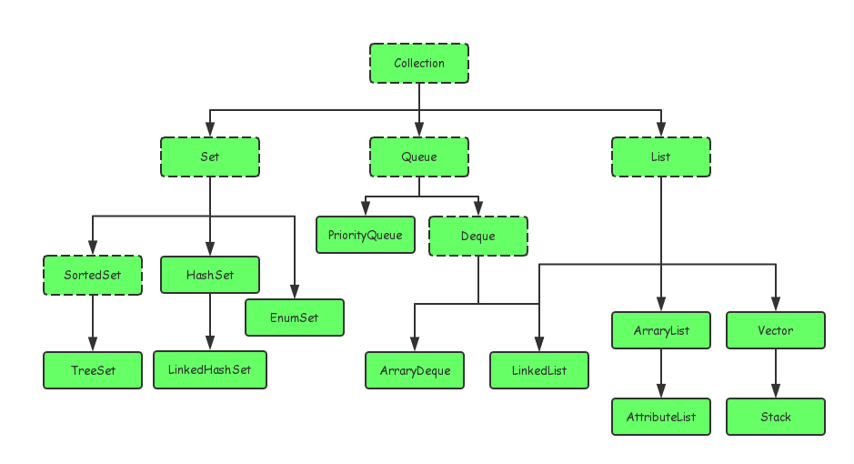
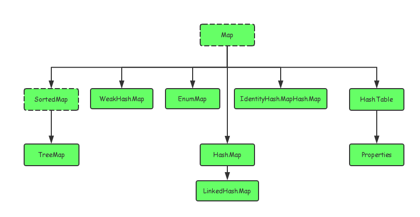
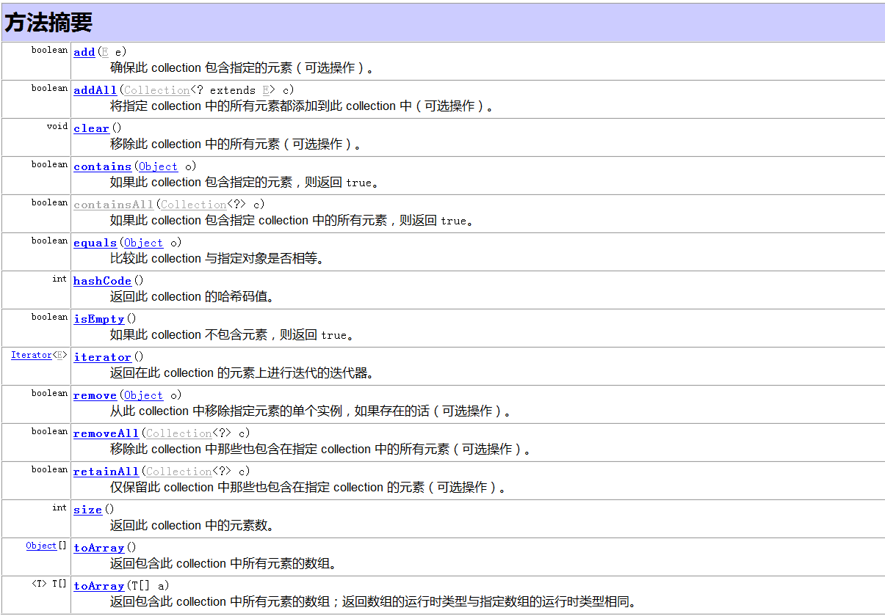

# _>集合<_
转载至[简书作者Ruheng](https://www.jianshu.com/p/589d58033841)
### 简介
&emsp;&emsp;本篇文章主要对java集合的框架进行介绍，使大家对java集合的整体框架有个了解。具体介绍了Collection接口，Map接口以及Collection接口的三个子接口Set，List，Queue。
### Java集合类简介：
&emsp;&emsp;java集合主要有Set、List、Queue、和Map四种体系

&emsp;&emsp;Set代表无序、不可重复的集合；

&emsp;&emsp;List代表有序、重复的集合；

&emsp;&emsp;Map则代表具有映射关系的集合，

&emsp;&emsp;Java 5 又增加了Queue体系集合，代表一种队列集合实现。

&emsp;&emsp;Java集合就像一种容器，可以把多个对象（实际上是对象的引用，但习惯上都称对象）“丢进”该容器中。从Java 5 增加了泛型以后，Java集合可以记住容器中对象的数据类型，使得编码更加简洁、健壮。
### Java集合和数组的区别：
&emsp;&emsp;1.数组长度在初始化时指定，意味着==只能保存定长的数据 #930a00==。而集合可以保存数量不确定的数据。同时可以保存具有映射关系的数据（即关联数组，键值对 key-value）。

&emsp;&emsp;2.数组元素即可以是基本类型的值，也可以是对象。==集合里只能保存对象 #a60600==（实际上只是保存对象的引用变量），基本数据类型的变量要转换成对应的包装类才能放入集合类中。
### Java集合类之间的继承关系:
&emsp;&emsp;Java的集合类主要由两个接口派生而出：Collection和Map,Collection和Map是Java集合框架的根接口。==Map实现类用于保存具有映射关系的数据==。Map保存的每项数据都是key-value对，也就是由key和value两个值组成。==Map里的key是不可重复的==，key用户标识集合里的每项数据。如下图：

&emsp;&emsp;以上我们经常用到的集合类型有ArrayList,HashSet,LinkedList,TreeSet,HashMap,TreeMap

### Collection接口中的方法：

