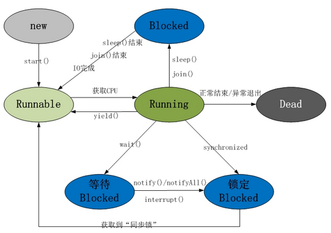
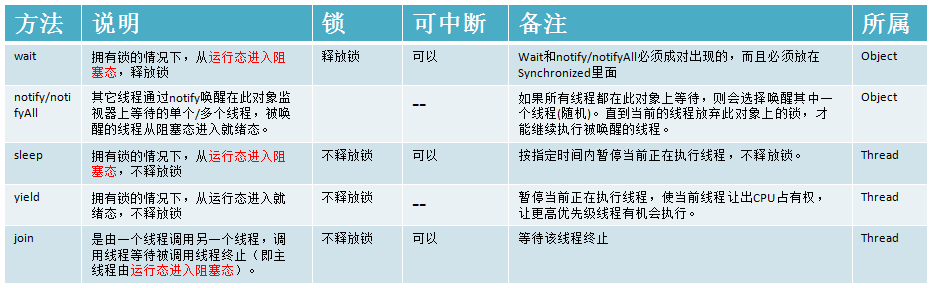

[参考](https://www.cnblogs.com/duanxz/category/1026463.html)

## 进程和线程

### 概念

&emsp;&emsp;线程：是程序执行流的最小单元，是系统独立调度和分配CPU（独立运行）的基本单位。

&emsp;&emsp;进程：是资源分配的基本单位。一个进程包括多个线程。

### 区别：

&emsp;&emsp;线程与资源分配无关，它属于某一个进程，并与进程内的其他线程一起共享进程的资源。

&emsp;&emsp;`每个进程都有自己一套独立的资源（数据），供其内的所有线程共享。`

&emsp;&emsp;不论是大小，开销线程要更“轻量级”

&emsp;&emsp;`一个线程内的线程通信比进程之间的通信更快速，有效。（因为共享变量）`

### 多线程与多进程

&emsp;&emsp;多线程：同一时刻执行多个线程。如，用浏览器一边下载，一边听歌，一边看视频，一边看网页......

&emsp;&emsp;多进程：同时执行多个程序。如，同事运行YY，QQ，以及各种浏览器。

### 并发与并行

&emsp;&emsp;并发：当有多个线程在操作时,如果系统只有一个CPU,则它根本不可能真正同时进行一个以上的线程，它只能把CPU运行时间划分成若干个时间段,再将时间 段分配给各个线程执行，在一个时间段的线程代码运行时，其它线程处于挂起状。.这种方式我们称之为并发(Concurrent)。

&emsp;&emsp;并行：当系统有一个以上CPU时,则线程的操作有可能非并发。当一个CPU执行一个线程时，另一个CPU可以执行另一个线程，两个线程互不抢占CPU资源，可以同时进行，这种方式我们称之为并行(Parallel)。

&emsp;&emsp;强烈注意：多核，多cpu，多机是不同的概念。 

### 补充：

&emsp;&emsp;多内核是指在一枚处理器中集成两个或多个完整的计算引擎(内核)。

&emsp;&emsp;多核心cpu主要分原生多核和封装多核。

&emsp;&emsp;- 原生多核指的是真正意义上的多核，每个核心之间都是完全独立的，都拥有自己的前端总线，不会造成冲突，即使在高负载状况下，每个核心都能保证自己的性能不受太大的影响，通俗的说，原生多核的抗压能力强，但是需要先进的工艺，每扩展一个核心都需要很多的研发时间。

&emsp;&emsp;- 封装多核是只把多个核心直接封装在一起，和原生的比起来还是差了很多，而且后者成本比较高，优点在于多核心的发展要比原生快的多。

&emsp;&emsp;多个处理机及存储器模块构成的并行处理机被称为多处理机系统(multiprocessor system)，简称多处理机。多机系统是将多个VLSI（超大规模集成电路）工艺集成的微处理机芯片结合在一起，由多个处理机并行工作以达到所需的高速度的，因此多机系统实际上是并行处理技术和VLSI技术相结合的产物。

## Java 多线程编程
&emsp;&emsp;Java 给多线程编程提供了内置的支持。 `一条线程指的是进程中一个单一顺序的控制流`，一个进程中可以并发多个线程，每条线程并行执行不同的任务。
多线程是多任务的一种特别的形式，但多线程使用了更小的资源开销。
&emsp;&emsp;这里定义和线程相关的另一个术语 - 进程`：一个进程包括由操作系统分配的内存空间，`包含一个或多个线程。`一个线程不能独立的存在，它必须是进程的一部分`。一个进程一直运行，直到所有的非守护线程都结束运行后才能结束。
&emsp;&emsp;多线程能满足程序员编写高效率的程序来达到充分利用 CPU 的目的。

### 一个线程的生命周期
&emsp;&emsp;线程是一个动态执行的过程，它也有一个从产生到死亡的过程。

&emsp;&emsp;下图显示了一个线程完整的生命周期

#### 新建状态:
&emsp;&emsp;使用 new 关键字和 Thread 类或其子类建立一个线程对象后，该线程对象就处于新建状态。它保持这个状态直到程序 start() 这个线程。

#### 就绪状态:
&emsp;&emsp;当线程对象调用了start()方法之后，该线程就进入就绪状态。就绪状态的线程处于就绪队列中，要等待JVM里线程调度器的调度。

#### 运行状态:
&emsp;&emsp;如果就绪状态的线程获取 CPU 资源，就可以执行 run()，此时线程便处于运行状态。处于运行状态的线程最为复杂，它可以变为阻塞状态、就绪状态和死亡状态。

#### 阻塞状态:
&emsp;&emsp;如果一个线程执行了sleep（睡眠）、suspend（挂起）等方法，失去所占用资源之后，该线程就从运行状态进入阻塞状态。在睡眠时间已到或获得设备资源后可以重新进入就绪状态。可以分为三种：

##### 等待阻塞：
&emsp;&emsp;运行状态中的线程执行 wait() 方法，使线程进入到等待阻塞状态。

##### 同步阻塞：
&emsp;&emsp;线程在获取 synchronized 同步锁失败(因为同步锁被其他线程占用)。

##### 其他阻塞：
&emsp;&emsp;通过调用线程的 sleep() 或 join() 发出了 I/O 请求时，线程就会进入到阻塞状态。当sleep() 状态超时，join() 等待线程终止或超时，或者 I/O 处理完毕，线程重新转入就绪状态。

##### 死亡状态:
&emsp;&emsp;一个运行状态的线程完成任务或者其他终止条件发生时，该线程就切换到终止状态。

### java线程中的关键方法sleep、wait、yield、join

&emsp;&emsp;Java中的多线程是一种抢占式的机制而不是分时机制。线程主要有以下几种状态：新建，就绪，运行，阻塞，死亡。`抢占式机制指的是有多个线程处于就绪状态，但是只有一个线程在运行。`

#### sleep()方法

　　在指定时间内让当前正在执行的线程暂停执行，但不会释放“锁标志”。不推荐使用。

　　sleep()使当前线程进入阻塞状态，在指定时间内不会执行。

#### wait()方法

　　在其他线程调用对象的notify或notifyAll方法前，导致当前线程等待。线程会释放掉它所占有的“锁标志”，从而使别的线程有机会抢占该锁。

　　当前线程必须拥有当前对象锁。如果当前线程不是此锁的拥有者，会抛出IllegalMonitorStateException异常。

　　唤醒当前对象锁的等待线程使用notify或notifyAll方法，也必须拥有相同的对象锁，否则也会抛出IllegalMonitorStateException异常。

　　wait() 和notify()必须在synchronized函数或synchronized　block中进行调用。如果在non-synchronized函数或non-synchronized　block中进行调用，虽然能编译通过，但在运行时会发生 IllegalMonitorStateException的异常。

#### yield方法

　　暂停当前正在执行的线程对象。

　　yield()只是使当前线程重新回到可执行状态，所以执行yield()的线程有可能在进入到可执行状态后马上又被执行。

　　yield()只能使同优先级或更高优先级的线程有执行的机会。

#### join方法

　　等待该线程终止。

　　等待调用join方法的线程结束，再继续执行。如：t.join();//主要用于等待t线程运行结束，若无此句，main则会执行完毕，导致结果不可预测。

## 线程同步

&emsp;&emsp;一个线程结束的标志是：run()方法结束。
一个机锁被释放的标志是：synchronized块或方法结束。
当有多个线程访问共享数据的时候，就需要对线程进行同步。线程同步相关的方法中的几个主要方法的按照所属可以分成：
Thread类的方法：sleep(),yield()等
Object的方法：wait()和notify()、notifyAll()等
Object中的对象头存放的锁信息在控制同步访问时使用。见《java对象在内存中的结构（HotSpot虚拟机）》和《Synchronized之二：synchronized的实现原理》

Wait()方法和notify()方法：当一个线程执行到wait()方法时，它就进入到一个和该对象相关的等待池中，同时失去了对象的机锁。当它被一个notify()方法唤醒时，等待池中的线程就被放到了锁池中。该线程从锁池中获得机锁，然后回到wait()前的中断现场。
 
Thread类中的方法：
由于sleep()方法是Thread类的方法，因此它不能改变对象的机锁。所以当在一个Synchronized方法中调用sleep()时，线程虽然休眠了，但是对象的机锁没有被释放，其他线程仍然无法访问这个对象。而wait()方法则会在线程休眠的同时释放掉机锁，其他线程可以访问该对象。
Yield()方法：是停止当前线程，让同等优先权的线程运行。如果没有同等优先权的线程，那么Yield()方法将不会起作用。
join()方法：是由一个线程调用另一个线程，调用线程等待被调用线程终止。
 
sleep()与wait()的共同点及不同点：
共同点： 他们都是在多线程的环境下，都可以在程序的调用处阻塞指定的毫秒数，并返回。
不同点： Thread.sleep(long)可以不在synchronized的块下调用，而且使用Thread.sleep()不会丢失当前线程对任何对象的同步锁(monitor);
              object.wait(long)必须在synchronized的块下来使用，调用了之后失去对object的monitor, 这样做的好处是它不影响其它的线程对object进行操作。

举个java.util.Timer的例子来说明。