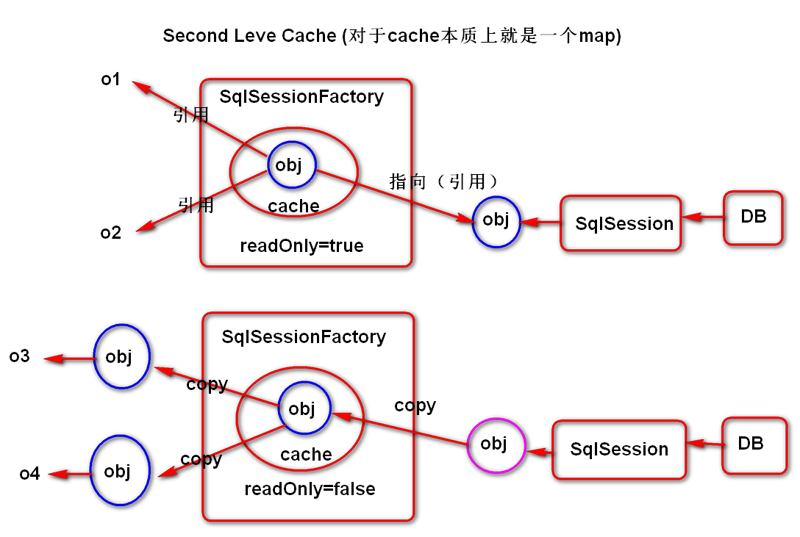
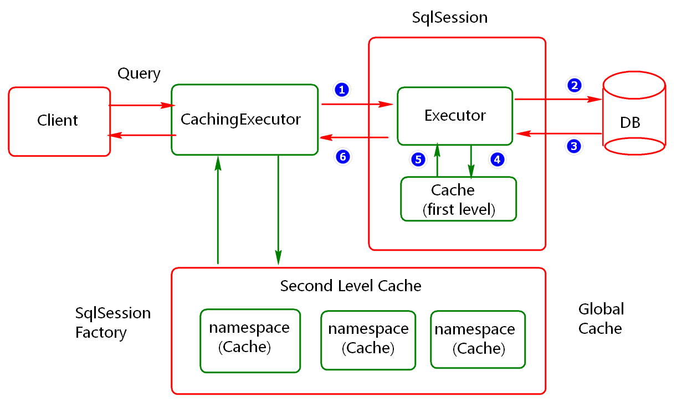
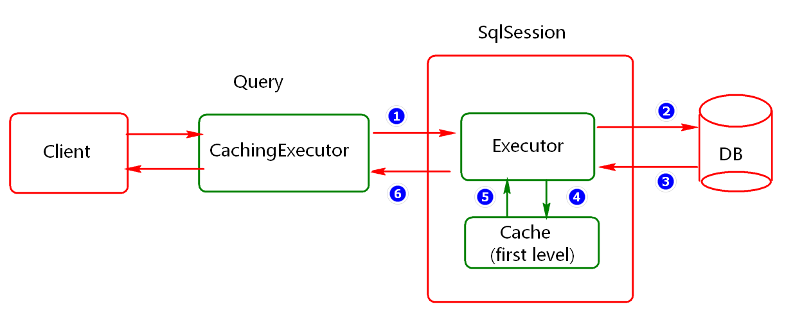

### MyBatis是用来解决数据持久化和对象关系映射问题的框架

MyBatis 由apache的ibatis演变而来，可以从如下几个方面加强理解与应用。

1)	软件框架(Framework): 用于解决软件中的通用型（共性）问题
2)	持久层框架(数据访问层):用于更好解决数据持久化问题
3)	半自动的ORM框架：解决对象关系映射问题。

思考：
1)	如何理解ORM（对象关系映射）:实现对象以及对象与对象关系的映射。

常用的ORM框架有hibernate，mybatis

hibernate (ORM 框架) :用于解决数据的持久化问题（数据库操作）

### MyBatis 应用场景

MyBatis主要应用于Java技术生态项目的研发。例如：

1）	Java传统桌面型项目(例如传统的计费系统等）
2）	Java web 互联网项目(例如电商项目，企业互联网业务系统)

1.1.3.	MyBatis 应用优势
思考：

1)	互联网项目的硬性要求是什么？（快速交付）
2)	互联网项目如何进行技术选型？
第一：稳定，可靠，性能;
第二：学习成本。
第三：是否可持续发展，社区支持的力度

思考：
传统JDBC开发劣势？

1)	编程步骤,参数配置及读取相对繁琐(配置信息的读取，都需要自己写代码)
2)	数据直接映射硬编码的强度会比较高（代码冗余相对较高，维护起来困难）
3)	数据关系映射的实现相对困难?（one2one,one2many,many2many）

### 框架MyBatis开发优势

1)	封装了JDBC共性，简化了代码的编写，提高了代码的开发速度，以及可维护性。
2)	合理的架构设计，提高了系统的稳定性，访问性能，可扩展性。


框架MyBatis开发劣势

1）	SQL语句编写的工作量相对较大。（相对hibernate框架）
2）	SQL语句依赖于数据库，移植性相对较差。（不是最大劣势）


### $符合#号的区别

````
			#号有预编译的效果,防止sql注入攻击问题
			#号为参数添加""号 当字符串
			
			$符
				如果需要以字段名称为参数时,使用$符.
				如果以字段为参数时添加#号.会导致业务异常
在使用#号时，mybatis会自动进行安全检测，所以在有用户输入的需求时
一般用#号，在传入值时，#号会把值转成字符串。例如：userId=#{userId}
传入111会转成“111”,传入id会转成“id”，而$在传值时只是把值穿进去
例如：userId=$“userId”,传入111，是userId，传入id是id，一般在使用order by的时候，输入的是固定的值的时候就用$
使用#的时候，相当于prepartstatement语句来安全的设置值，preparement 
Ps = conn.prepareStatement(sql);好处是：更安全，更快首选做法

使用$的时候，相当于statement st = conn.createStatement();
resultSet rs = st.exectuteQuery(sql)
缺点:用户输入固定的字符串是不安全的，会导致潜在的sql注入攻击， 因此最好不要输入这些字段，要么自行转移校检
````

### MyBatis数据处理层
MyBatis数据处理层主要负责处理数据访问问题

1)	SQL参数映射(Dao方法参数与映射文件中#{}表达式映射)
2)	SQL解析(语法,语义) 例如: select * from blog where id=#{id}
3)	SQL 执行(将sql发送到数据库端执行)
4)	SQL 结果映射(例如将ResultSet中的数据存到map)


### MyBatis基础服务层
MyBatis基础服务层主要负责提供如下几个方面的服务：

1)	连接服务 (配置连接池,)
2)	事务服务（保证数据的原子性，一致性，隔离性，一致性。）
3)	缓存服务（更好的提高查询性能）
4)	配置服务 (别名配置,映射配置,...,日志配置,....)

### MyBatis 核心API
MyBatis 项目中核心API：

1.	SqlSessionFactoryBuilder (负责读取配置文件,创建SqlSessionFactory对象)
2.	SqlSessionFactory(负责创建SqlSession对象)
3.	SqlSession(负责连接的维护,事务的处理,类似JDBC中的Connection)
4.	SqlsessionTemplate(模板方法模式)

底层API
configuration，mappedStatement
defaultSqlsessionFactory
defaultSession
executor

思考:

1)核心组件在应用中的一个角色定位?
2)应用底层会用到哪些设计模式?建造模式,工厂模式


Mybatis中所有的Mapper语句的执行都是通过Executor进行的，Executor是Mybatis的一个核心接口，其定义如下。从其定义的接口方法我们可以看出，对应的增删改语句是通过Executor接口的update方法进行的，查询是通过query方法进行的。虽然Executor接口的实现类有BaseExecutor和CachingExecutor，而BaseExecutor的子类又有SimpleExecutor、ReuseExecutor和BatchExecutor，但BaseExecutor是一个抽象类，其只实现了一些公共的封装，而把真正的核心实现都通过方法抽象出来给子类实现，如doUpdate()、doQuery()；CachingExecutor只是在Executor的基础上加入了缓存的功能，底层还是通过Executor调用的，所以真正有作用的Executor只有SimpleExecutor、ReuseExecutor和BatchExecutor。它们都是自己实现的Executor核心功能，没有借助任何其它的Executor实现，它们是实现不同也就注定了它们的功能也是不一样的。Executor是跟SqlSession绑定在一起的，每一个SqlSession都拥有一个新的Executor对象，由Configuration创建。

 ReuseExecutor，顾名思义，是可以重用的Executor。它重用的是Statement对象，它会在内部利用一个Map把创建的Statement都缓存起来，每次在执行一条SQL语句时，它都会去判断之前是否存在基于该SQL缓存的Statement对象，存在而且之前缓存的Statement对象对应的Connection还没有关闭的时候就继续用之前的Statement对象，否则将创建一个新的Statement对象，并将其缓存起来。因为每一个新的SqlSession都有一个新的Executor对象，所以我们缓存在ReuseExecutor上的Statement的作用域是同一个SqlSession。
 
  SimpleExecutor是Mybatis执行Mapper语句时默认使用的Executor。它提供最基本的Mapper语句执行功能，没有过多的封装的。
  
   ReuseExecutor，顾名思义，是可以重用的Executor。它重用的是Statement对象，它会在内部利用一个Map把创建的Statement都缓存起来，每次在执行一条SQL语句时，它都会去判断之前是否存在基于该SQL缓存的Statement对象，存在而且之前缓存的Statement对象对应的Connection还没有关闭的时候就继续用之前的Statement对象，否则将创建一个新的Statement对象，并将其缓存起来。因为每一个新的SqlSession都有一个新的Executor对象，所以我们缓存在ReuseExecutor上的Statement的作用域是同一个SqlSession。
   
  BatchExecutor的设计主要是用于做批量更新操作的。其底层会调用Statement的executeBatch()方法实现批量操作。
	 既然BaseExecutor下面有SimpleExecutor、ReuseExecutor和BatchExecutor，Executor还有一个CachingExecutor的实现，那我们怎么选择使用哪个Executor呢？默认情况下Mybatis的全局配置cachingEnabled=”true”，这就意味着默认情况下我们就会使用一个CachingExecutor来包装我们真正使用的Executor，这个在后续介绍Mybatis的缓存的文章中会介绍。那我们真正使用的BaseExecutor是怎么确定的呢？是通过我们在创建SqlSession的时候确定的。SqlSession都是通过SqlSessionFactory的openSession()创建的，SqlSessionFactory提供了一系列的openSession()方法。
		 
 从上面SqlSessionFactory提供的方法来看，它一共提供了两类创建SqlSession的方法，一类是没有指定ExecutorType的，一类是指定了ExecutorType的。很显然，指定了ExecutorType时将使用ExecutorType对应类型的Executor。ExecutorType是一个枚举类型，有SIMPLE、REUSE和BATCH三个对象。

   而没有指定ExecutorType时将使用默认的Executor。Mybatis默认的Executor是SimpleExecutor，我们可以通过Mybatis的全局配置defaultExecutorType来进行配置，其可选值也是SIMPLE、REUSE和BATCH。

      <setting name="defaultExecutorType" value="SIMPLE"/>

 注意，当Mybatis整合Spring后，Spring扫描后生成的Mapper对象，底层使用的SqlSession都是用的默认的Executor。如果我们需要在程序中使用非默认的Executor时，我们可以在Spring的bean容器中声明SqlSessionFactoryBean，然后在需要指定Executor的类中注入SqlSessionFactory，通过SqlSessionFactory来创建指定ExecutorType的SqlSession。
 
 
  <insert id="insertObject"
           parameterType="blog"
           useGeneratedKeys="true"
           keyProperty="id">
           insert into blog
           (id,title,content,createdTime)
           values
           (null,#{title},#{content},now())
   </insert>
其中:keyProperty属性用于指定参数中的id属性.

2.	当多线程并发的向表中写入数据时,假如id使用自增长可能存在线程安全问题?
例如: 
1)	秒杀系统(电商系统)
2)	订票系统(12306)
3)	....
解决方案:可将自增长的id设置为随机数,当然有些数据库根本就不支持自增长,此时也可以选择随机数.


2.	添加log4j.properties 配置(可以从其它项目中拷贝)

log4j.rootLogger=INFO,stdout
log4j.appender.stdout=org.apache.log4j.ConsoleAppender
log4j.appender.stdout.layout=org.apache.log4j.PatternLayout
log4j.appender.stdout.layout.ConversionPattern=%d [%-5p] %c - %m%n

log4j.logger.com.mybatis3=DEBUG
log4j.logger.com.jt=DEBUG

3.	设置mybatis的日志实现(mybatis-configs.xml)

  <settings>
     <setting name="logImpl" value="log4j"/>
  </settings>

其中name属性的值为固定写法,value的值要依托于使用的日志处理库.

说明:课后了解常用的日志处理库.


4.2.	缓存配置应用(了解)
4.2.1.	缓存基本概述
1.	缓存是什么? 内存中的一个对象(容器).
2.	缓存对象的作用?提高程序的性能(最主要的的是访问效率)
3.	MyBatis 中缓存概述?
MyBatis 框架中提供了非常强大的缓存特性来提高查询性能,通常可将其分为一级缓存(SqlSession级别)和二级缓存(SqlSessionFactory级别)。
4.2.2.	缓存基本实现
MyBatis 一级缓存应用：

MyBatis中一级缓存默认是开启的.不需要任何配置.例如:

测试方案1：（验证一级缓存）

@Test
public void testFirstLevelCache01(){
		SqlSession session=factory.openSession();
		AuthorDao dao=session.getMapper(AuthorDao.class);
		String id="5e5f90ed324e11e8a9b279bf5362f090";
		dao.findAuthorById(id);
		dao.findAuthorById(id);//本次查询从缓存取
		session.commit();
		session.close();

}

测试方案1：（验证缓存失效）

验证数据插入导致的缓存失效。

@Test
public void testFirstLevelCache01(){
		SqlSession session=factory.openSession();
		AuthorDao dao=session.getMapper(AuthorDao.class);
		String id="5e5f90ed324e11e8a9b279bf5362f090";
		dao.findAuthorById(id);
		Author entity=new Author();
		entity.setUsername("user-KK");
		entity.setPassword("123456");
		entity.setEmail("KK@t.com");
		dao.insertAuthor(entity);
		dao.findAuthorById(id);
		session.commit();
		session.close();
	}

验证更新后的缓存失效。

@Test
	public void testFirstLevelCache02(){
		SqlSession session=factory.openSession();
		AuthorDao dao=session.getMapper(AuthorDao.class);
		String id="5e5f90ed324e11e8a9b279bf5362f090";
		Author a1=dao.findAuthorById(id);
		System.out.println(a1);
		Author a=new Author();
		a.setId(id);
		a.setUsername("user-aaa");
		a.setEmail("aaa@t.com");
		dao.updateAuthor(a1);
		Author a2=dao.findAuthorById(id);
		System.out.println(a2);
		session.commit();
		session.close();
	}

验证缓存脏读问题（此问题可通过配置缓存类型为STATEMENT类型解决）

@Test
public void testFirstLevelCache03(){
		SqlSession session1=2factory.openSession(true);
		SqlSession session2=factory.openSession(true);
		AuthorDao dao1=session1.getMapper(AuthorDao.class);
		AuthorDao dao2=session2.getMapper(AuthorDao.class);
		String id="5e5f90ed324e11e8a9b279bf5362f090";
		Author a1=dao1.findAuthorById(id);
		System.out.println(a1);
		Author a=new Author();
		a.setId(id);
		a.setUsername("user-oo");
		a.setEmail("oo@t.com");
		int rows=dao2.updateAuthor(a);
		session2.close();
		Author a2=dao1.findAuthorById(id);
		System.out.println(a2);
		session1.close();
	}


MyBatis：一级缓存应用说明：

1)	默认是开启的(也是应用最多的一种)
2)	其类型为SESSION或STATEMENT两种，默认是SESSION类型
a)	缓存对象的生命周期不同(例如session类型的一级缓存，session关闭就失效.)
b)	其类型的配置可在配置文件中通过这个localCacheScope属性进行配置。
3)	一级缓存在每次更新(同一个session)后都会失效。
4)	一级缓存在事务并发执行时可能会出现脏读，但相对于STATEMENT效率会高一些。

MyBatis 二级缓存应用：

MyBatis 二级缓存默认是没有开启的,需要在映射文件中加上<Cache/>元素
MyBatis 二级缓存应用步骤:
Step01: 修改mybatis核心配置文件,添加缓存设置.

<settings>
     <setting name="cacheEnabled" value="true"/>
  </settings>

Step02: 在映射文件（XxxMapper.xml）中配置Cache策略.

 <cache
     eviction="LRU"
     flushInterval="60000"
     size="512"
     readOnly="true"/>

这个表示创建了一个 LRU缓存,最多存储512个对象，并每隔 60 秒刷新,而且返回的对象被认为是只读的,因此在不同线程中的调用者之间修改它们会导致冲突。其中：

1)	eviction 表示回收策略(例如LRU,FIFO等，默认为LRU)
2)	flushInterval 表示刷新间隔
3)	size(引用数目)可以被设置为任意正整数,要记住你缓存的对象数目和你运行环境的 可用内存资源数目。默认值是 1024。
4)	readOnly(只读)属性可以被设置为 true 或 false。只读的缓存会给所有调用者返回缓存对象的相同实例。可读写的缓存会返回缓存对象的拷贝(通过序列化) 。这会慢一些,但是安全,因此默认是 false。

Step03: 使用二级缓存了.

@Test
public void testSecondLevelCache01(){
		SqlSession session1=factory.openSession();
		SqlSession session2=factory.openSession();
		SqlSession session3=factory.openSession();
		AuthorDao dao1=session1.getMapper(AuthorDao.class);
		AuthorDao dao2=session2.getMapper(AuthorDao.class);
		AuthorDao dao3=session3.getMapper(AuthorDao.class);
		String id="5e5f90ed324e11e8a9b279bf5362f090";
		Author a1=dao1.findAuthorById(id);
		System.out.println(a1);
		session1.close();//session关闭时，a1指向对象会存储到缓存
		Author a2=dao2.findAuthorById(id);//从二级缓存获取
		System.out.println(a2);
		a2.setUsername("user-tedu-01");
		Author a3=dao3.findAuthorById(id);//从二级缓存获取
		System.out.println(a3);
		System.out.println(a1==a2);//true
		System.out.println(a2==a3);//true
		//a1,a2,a3指向的是同一个对象
		session2.close();
		session3.close();
	}
association解决多对一，collection解决一对多

readOnly说明:

1)readOnly的值为true时,缓存中保存的是堆内存中对象的引用.每次从缓存取数据都是获得的同一个对象.readOnly为false时,首先会将查询到的对象,拷贝到缓存一份(对象需要实现序列化接口),然后从缓存取数据每次都是执行对象的拷贝.

2)MyBatis 中的二级缓存同样存在脏读问题，尤其是在分布式应用场景中表现出的问题就会更加突出。







