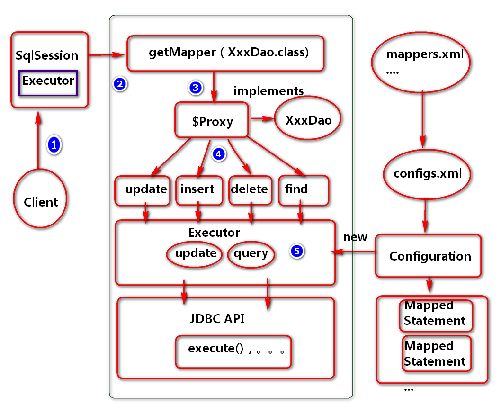

### MyBatis是用来解决数据持久化和对象关系映射问题的框架

MyBatis 由apache的ibatis演变而来，可以从如下几个方面加强理解与应用。

1)	软件框架(Framework): 用于解决软件中的通用型（共性）问题
2)	持久层框架(数据访问层):用于更好解决数据持久化问题
3)	半自动的ORM框架：解决对象关系映射问题。

思考：
1)	如何理解ORM（对象关系映射）:实现对象以及对象与对象关系的映射。

常用的ORM框架有hibernate，mybatis

hibernate (ORM 框架) :用于解决数据的持久化问题（数据库操作）

### MyBatis 应用场景

MyBatis主要应用于Java技术生态项目的研发。例如：

1）	Java传统桌面型项目(例如传统的计费系统等）
2）	Java web 互联网项目(例如电商项目，企业互联网业务系统)

1.1.3.	MyBatis 应用优势
思考：

1)	互联网项目的硬性要求是什么？（快速交付）
2)	互联网项目如何进行技术选型？
第一：稳定，可靠，性能;
第二：学习成本。
第三：是否可持续发展，社区支持的力度

思考：
传统JDBC开发劣势？

1)	编程步骤,参数配置及读取相对繁琐(配置信息的读取，都需要自己写代码)
2)	数据直接映射硬编码的强度会比较高（代码冗余相对较高，维护起来困难）
3)	数据关系映射的实现相对困难?（one2one,one2many,many2many）

### 框架MyBatis开发优势

1)	封装了JDBC共性，简化了代码的编写，提高了代码的开发速度，以及可维护性。
2)	合理的架构设计，提高了系统的稳定性，访问性能，可扩展性。


框架MyBatis开发劣势

1）	SQL语句编写的工作量相对较大。（相对hibernate框架）
2）	SQL语句依赖于数据库，移植性相对较差。（不是最大劣势）


### $符合#号的区别

````
			#号有预编译的效果,防止sql注入攻击问题
			#号为参数添加""号 当字符串
			
			$符
				如果需要以字段名称为参数时,使用$符.
				如果以字段为参数时添加#号.会导致业务异常
在使用#号时，mybatis会自动进行安全检测，所以在有用户输入的需求时
一般用#号，在传入值时，#号会把值转成字符串。例如：userId=#{userId}
传入111会转成“111”,传入id会转成“id”，而$在传值时只是把值穿进去
例如：userId=$“userId”,传入111，是userId，传入id是id，一般在使用order by的时候，输入的是固定的值的时候就用$
使用#的时候，相当于prepartstatement语句来安全的设置值，preparement 
Ps = conn.prepareStatement(sql);好处是：更安全，更快首选做法

使用$的时候，相当于statement st = conn.createStatement();
resultSet rs = st.exectuteQuery(sql)
缺点:用户输入固定的字符串是不安全的，会导致潜在的sql注入攻击， 因此最好不要输入这些字段，要么自行转移校检
````

### MyBatis数据处理层
MyBatis数据处理层主要负责处理数据访问问题

1)	SQL参数映射(Dao方法参数与映射文件中#{}表达式映射)
2)	SQL解析(语法,语义) 例如: select * from blog where id=#{id}
3)	SQL 执行(将sql发送到数据库端执行)
4)	SQL 结果映射(例如将ResultSet中的数据存到map)


### MyBatis基础服务层
MyBatis基础服务层主要负责提供如下几个方面的服务：

1)	连接服务 (配置连接池,)
2)	事务服务（保证数据的原子性，一致性，隔离性，一致性。）
3)	缓存服务（更好的提高查询性能）
4)	配置服务 (别名配置,映射配置,...,日志配置,....)

### MyBatis 核心API
MyBatis 项目中核心API：

1.	SqlSessionFactoryBuilder (负责读取配置文件,创建SqlSessionFactory对象)
2.	SqlSessionFactory(负责创建SqlSession对象)
3.	SqlSession(负责连接的维护,事务的处理,类似JDBC中的Connection)

思考:

1)核心组件在应用中的一个角色定位?
2)应用底层会用到哪些设计模式?建造模式,工厂模式

