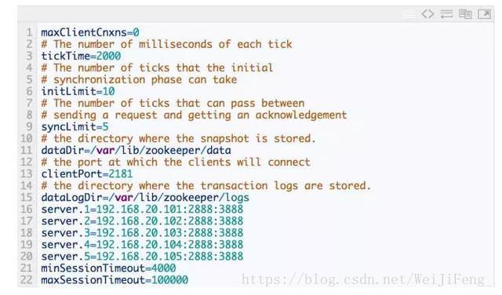

## 功能简介
 ZooKeeper 是一个开源的分布式协调服务，由雅虎创建，是 Google Chubby 的开源实现。分布式应用程序可以基于 ZooKeeper 实现诸如数据发布/订阅、负载均衡、命名服务、分布式协调/通知、集群管理、Master 选举、配置维护，名字服务、分布式同步、分布式锁和分布式队列等功能。
 
## ZooKeeper基本概念

### 集群角色
&emsp;&emsp;zookeeper中包含三个角色：Leader、Follower、Observer

&emsp;&emsp;一个 ZooKeeper 集群同一时刻只会有一个 Leader，其他都是 Follower 或 Observer。

&emsp;&emsp;ZooKeeper 配置很简单，每个节点的配置文件(zoo.cfg)都是一样的，只有 myid 文件不一样。myid 的值必须是 zoo.cfg中server.{数值} 的{数值}部分。

&emsp;&emsp;zoo.cfg配置文件示例 

&emsp;&emsp;在装有 ZooKeeper 的机器的终端执行 zookeeper-server status 可以看当前节点的 ZooKeeper是什么角色（Leader or Follower）。

&emsp;&emsp;ZooKeeper 默认只有 Leader 和 Follower 两种角色，没有 Observer 角色。为了使用 Observer 模式，在任何想变成Observer的节点的配置文件中加入:peerType=observer 并在所有 server 的配置文件中，配置成 observer 模式的 server 的那行配置追加 :observer

### 节点读写服务分工

&emsp;&emsp;1.ZooKeeper `集群的所有机器通过一个 Leader 选举过程来选定一台被称为『Leader』的机器`，`Leader服务器为客户端提供读和写服务。`

&emsp;&emsp;2.Follower 和 Observer 都能提供读服务，不能提供写服务。两者唯一的区别在于，`Observer机器不参与 Leader 选举过程，也不参与写操作的『过半写成功』策略`，因此 `Observer 可以在不影响写性能的情况下提升集群的读性能。`

### Session
&emsp;&emsp;Session 是指客户端会话，在讲解客户端会话之前，我们先来了解下客户端连接。在ZooKeeper 中，一个客户端连接是指客户端和 ZooKeeper 服务器之间的TCP长连接。
&emsp;&emsp;ZooKeeper 对外的服务端口默认是2181，客户端启动时，首先会与服务器建立一个TCP连接，从第一次连接建立开始，客户端会话的生命周期也开始了，通过这个连接，客户端能够通过心跳检测和服务器保持有效的会话，也能够向 ZooKeeper 服务器发送请求并接受响应，同时还能通过该连接接收来自服务器的 Watch 事件通知。
&emsp;&emsp;Session 的 SessionTimeout 值用来设置一个客户端会话的超时时间。当由于服务器压力太大、网络故障或是客户端主动断开连接等各种原因导致客户端连接断开时，只要在SessionTimeout 规定的时间内能够重新连接上集群中任意一台服务器，那么之前创建的会话仍然有效。

### 数据节点

&emsp;&emsp;zookeeper的结构其实就是一个树形结构，leader就相当于其中的根结点，其它节点就相当follow节点，每个节点都保留自己的内容。

&emsp;&emsp;zookeeper的节点分两类：持久节点和临时节点
&emsp;&emsp;- 持久节点：
&emsp;&emsp;&emsp;&emsp;所谓持久节点是指一旦这个 树形结构上被创建了，除非主动进行对树节点的移除操作，否则这个 节点将一直保存在 ZooKeeper 上。

&emsp;&emsp;-临时节点：
&emsp;&emsp;&emsp;&emsp;临时节点的生命周期跟客户端会话绑定，一旦客户端会话失效，那么这个客户端创建的所有临时节点都会被移除。

5 . 状态信息

    每个 节点除了存储数据内容之外，还存储了 节点本身的一些状态信息。用 get 命令可以
同时获得某个 节点的内容和状态信息
    在 ZooKeeper 中，version 属性是用来实现乐观锁机制中的『写入校验』的（保证分布
式数据原子性操作）。

6 .事物操作

    在ZooKeeper中，能改变ZooKeeper服务器状态的操作称为事务操作。一般包括数据节点
创建与删除、数据内容更新和客户端会话创建与失效等操作。对应每一个事务请求，ZooKeeper
都会为其分配一个全局唯一的事务ID，用 ZXID 表示，通常是一个64位的数字。每一个 ZXID
对应一次更新操作，从这些 ZXID 中可以间接地识别出 ZooKeeper 处理这些事务操作请求的
全局顺序。

7 .Watcher(事件监听器)

    是 ZooKeeper 中一个很重要的特性。ZooKeeper允许用户在指定节点上注册一些 Watcher，
并且在一些特定事件触发的时候，ZooKeeper 服务端会将事件通知到感兴趣的客户端上去。该
机制是 ZooKeeper 实现分布式协调服务的重要特性。